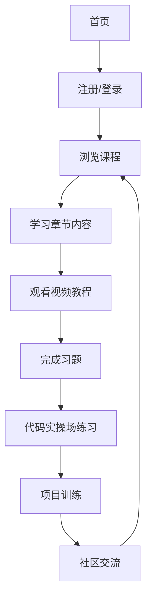

# Python学练写一体化网站 -# Python学练写一体化网站 - 产品需求文档

## 1. 产品概述
Python学练写一体化网站是# Python学练写一体化网站 - 产品需求文档

## 1. 产品概述
Python学练写一体化网站是一个综合性在线学习平台，为用户提供从入门到进阶的Python学习体验，通过课程# Python学练写一体化网站 - 产品需求文档

## 1. 产品概述
Python学练写一体化网站是一个综合性在线学习平台，为用户提供从入门到进阶的Python学习体验，通过课程、项目、代码实操场和视频教程等# Python学练写一体化网站 - 产品需求文档

## 1. 产品概述
Python学练写一体化网站是一个综合性在线学习平台，为用户提供从入门到进阶的Python学习体验，通过课程、项目、代码实操场和视频教程等多种形式，帮助用户全面掌握Python编程技能# Python学练写一体化网站 - 产品需求文档

## 1. 产品概述
Python学练写一体化网站是一个综合性在线学习平台，为用户提供从入门到进阶的Python学习体验，通过课程、项目、代码实操场和视频教程等多种形式，帮助用户全面掌握Python编程技能。
- 主要目的是解决传统# Python学练写一体化网站 - 产品需求文档

## 1. 产品概述
Python学练写一体化网站是一个综合性在线学习平台，为用户提供从入门到进阶的Python学习体验，通过课程、项目、代码实操场和视频教程等多种形式，帮助用户全面掌握Python编程技能。
- 主要目的是解决传统Python学习中缺乏实践机会和互动性的# Python学练写一体化网站 - 产品需求文档

## 1. 产品概述
Python学练写一体化网站是一个综合性在线学习平台，为用户提供从入门到进阶的Python学习体验，通过课程、项目、代码实操场和视频教程等多种形式，帮助用户全面掌握Python编程技能。
- 主要目的是解决传统Python学习中缺乏实践机会和互动性的问题，为用户提供沉浸式学习体验
-# Python学练写一体化网站 - 产品需求文档

## 1. 产品概述
Python学练写一体化网站是一个综合性在线学习平台，为用户提供从入门到进阶的Python学习体验，通过课程、项目、代码实操场和视频教程等多种形式，帮助用户全面掌握Python编程技能。
- 主要目的是解决传统Python学习中缺乏实践机会和互动性的问题，为用户提供沉浸式学习体验
- 目标用户包括Python初学者、中级开发者以及# Python学练写一体化网站 - 产品需求文档

## 1. 产品概述
Python学练写一体化网站是一个综合性在线学习平台，为用户提供从入门到进阶的Python学习体验，通过课程、项目、代码实操场和视频教程等多种形式，帮助用户全面掌握Python编程技能。
- 主要目的是解决传统Python学习中缺乏实践机会和互动性的问题，为用户提供沉浸式学习体验
- 目标用户包括Python初学者、中级开发者以及希望提升Python技能的专业人士

### Python学练写一体化网站 - 产品需求文档

## 1. 产品概述
Python学练写一体化网站是一个综合性在线学习平台，为用户提供从入门到进阶的Python学习体验，通过课程、项目、代码实操场和视频教程等多种形式，帮助用户全面掌握Python编程技能。
- 主要目的是解决传统Python学习中缺乏实践机会和互动性的问题，为用户提供沉浸式学习体验
- 目标用户包括Python初学者、中级开发者以及希望提升Python技能的专业人士

## 2. 核心功能

#### Python学练写一体化网站 - 产品需求文档

## 1. 产品概述
Python学练写一体化网站是一个综合性在线学习平台，为用户提供从入门到进阶的Python学习体验，通过课程、项目、代码实操场和视频教程等多种形式，帮助用户全面掌握Python编程技能。
- 主要目的是解决传统Python学习中缺乏实践机会和互动性的问题，为用户提供沉浸式学习体验
- 目标用户包括Python初学者、中级开发者以及希望提升Python技能的专业人士

## 2. 核心功能

### 2.1 用户角色
| 角色 | 注册方式 | 核心权限 |
# Python学练写一体化网站 - 产品需求文档

## 1. 产品概述
Python学练写一体化网站是一个综合性在线学习平台，为用户提供从入门到进阶的Python学习体验，通过课程、项目、代码实操场和视频教程等多种形式，帮助用户全面掌握Python编程技能。
- 主要目的是解决传统Python学习中缺乏实践机会和互动性的问题，为用户提供沉浸式学习体验
- 目标用户包括Python初学者、中级开发者以及希望提升Python技能的专业人士

## 2. 核心功能

### 2.1 用户角色
| 角色 | 注册方式 | 核心权限 |
|------|---------------------|------------------|
| 普通用户 | 邮箱注册 |# Python学练写一体化网站 - 产品需求文档

## 1. 产品概述
Python学练写一体化网站是一个综合性在线学习平台，为用户提供从入门到进阶的Python学习体验，通过课程、项目、代码实操场和视频教程等多种形式，帮助用户全面掌握Python编程技能。
- 主要目的是解决传统Python学习中缺乏实践机会和互动性的问题，为用户提供沉浸式学习体验
- 目标用户包括Python初学者、中级开发者以及希望提升Python技能的专业人士

## 2. 核心功能

### 2.1 用户角色
| 角色 | 注册方式 | 核心权限 |
|------|---------------------|------------------|
| 普通用户 | 邮箱注册 | 浏览课程、完成练习、参与社区讨论 |# Python学练写一体化网站 - 产品需求文档

## 1. 产品概述
Python学练写一体化网站是一个综合性在线学习平台，为用户提供从入门到进阶的Python学习体验，通过课程、项目、代码实操场和视频教程等多种形式，帮助用户全面掌握Python编程技能。
- 主要目的是解决传统Python学习中缺乏实践机会和互动性的问题，为用户提供沉浸式学习体验
- 目标用户包括Python初学者、中级开发者以及希望提升Python技能的专业人士

## 2. 核心功能

### 2.1 用户角色
| 角色 | 注册方式 | 核心权限 |
|------|---------------------|------------------|
| 普通用户 | 邮箱注册 | 浏览课程、完成练习、参与社区讨论 |
| 注册用户 | 邮箱注册# Python学练写一体化网站 - 产品需求文档

## 1. 产品概述
Python学练写一体化网站是一个综合性在线学习平台，为用户提供从入门到进阶的Python学习体验，通过课程、项目、代码实操场和视频教程等多种形式，帮助用户全面掌握Python编程技能。
- 主要目的是解决传统Python学习中缺乏实践机会和互动性的问题，为用户提供沉浸式学习体验
- 目标用户包括Python初学者、中级开发者以及希望提升Python技能的专业人士

## 2. 核心功能

### 2.1 用户角色
| 角色 | 注册方式 | 核心权限 |
|------|---------------------|------------------|
| 普通用户 | 邮箱注册 | 浏览课程、完成练习、参与社区讨论 |
| 注册用户 | 邮箱注册并登录 | 保存学习进度、收藏内容# Python学练写一体化网站 - 产品需求文档

## 1. 产品概述
Python学练写一体化网站是一个综合性在线学习平台，为用户提供从入门到进阶的Python学习体验，通过课程、项目、代码实操场和视频教程等多种形式，帮助用户全面掌握Python编程技能。
- 主要目的是解决传统Python学习中缺乏实践机会和互动性的问题，为用户提供沉浸式学习体验
- 目标用户包括Python初学者、中级开发者以及希望提升Python技能的专业人士

## 2. 核心功能

### 2.1 用户角色
| 角色 | 注册方式 | 核心权限 |
|------|---------------------|------------------|
| 普通用户 | 邮箱注册 | 浏览课程、完成练习、参与社区讨论 |
| 注册用户 | 邮箱注册并登录 | 保存学习进度、收藏内容、发布社区帖子 |

#### Python学练写一体化网站 - 产品需求文档

## 1. 产品概述
Python学练写一体化网站是一个综合性在线学习平台，为用户提供从入门到进阶的Python学习体验，通过课程、项目、代码实操场和视频教程等多种形式，帮助用户全面掌握Python编程技能。
- 主要目的是解决传统Python学习中缺乏实践机会和互动性的问题，为用户提供沉浸式学习体验
- 目标用户包括Python初学者、中级开发者以及希望提升Python技能的专业人士

## 2. 核心功能

### 2.1 用户角色
| 角色 | 注册方式 | 核心权限 |
|------|---------------------|------------------|
| 普通用户 | 邮箱注册 | 浏览课程、完成练习、参与社区讨论 |
| 注册用户 | 邮箱注册并登录 | 保存学习进度、收藏内容、发布社区帖子 |

### 2.2 功能模块
1. **首页**：平台介绍、核心功能导航、# Python学练写一体化网站 - 产品需求文档

## 1. 产品概述
Python学练写一体化网站是一个综合性在线学习平台，为用户提供从入门到进阶的Python学习体验，通过课程、项目、代码实操场和视频教程等多种形式，帮助用户全面掌握Python编程技能。
- 主要目的是解决传统Python学习中缺乏实践机会和互动性的问题，为用户提供沉浸式学习体验
- 目标用户包括Python初学者、中级开发者以及希望提升Python技能的专业人士

## 2. 核心功能

### 2.1 用户角色
| 角色 | 注册方式 | 核心权限 |
|------|---------------------|------------------|
| 普通用户 | 邮箱注册 | 浏览课程、完成练习、参与社区讨论 |
| 注册用户 | 邮箱注册并登录 | 保存学习进度、收藏内容、发布社区帖子 |

### 2.2 功能模块
1. **首页**：平台介绍、核心功能导航、学习路径推荐
2. **课程学习**# Python学练写一体化网站 - 产品需求文档

## 1. 产品概述
Python学练写一体化网站是一个综合性在线学习平台，为用户提供从入门到进阶的Python学习体验，通过课程、项目、代码实操场和视频教程等多种形式，帮助用户全面掌握Python编程技能。
- 主要目的是解决传统Python学习中缺乏实践机会和互动性的问题，为用户提供沉浸式学习体验
- 目标用户包括Python初学者、中级开发者以及希望提升Python技能的专业人士

## 2. 核心功能

### 2.1 用户角色
| 角色 | 注册方式 | 核心权限 |
|------|---------------------|------------------|
| 普通用户 | 邮箱注册 | 浏览课程、完成练习、参与社区讨论 |
| 注册用户 | 邮箱注册并登录 | 保存学习进度、收藏内容、发布社区帖子 |

### 2.2 功能模块
1. **首页**：平台介绍、核心功能导航、学习路径推荐
2. **课程学习**：课程列表、章节详情、视频教程、# Python学练写一体化网站 - 产品需求文档

## 1. 产品概述
Python学练写一体化网站是一个综合性在线学习平台，为用户提供从入门到进阶的Python学习体验，通过课程、项目、代码实操场和视频教程等多种形式，帮助用户全面掌握Python编程技能。
- 主要目的是解决传统Python学习中缺乏实践机会和互动性的问题，为用户提供沉浸式学习体验
- 目标用户包括Python初学者、中级开发者以及希望提升Python技能的专业人士

## 2. 核心功能

### 2.1 用户角色
| 角色 | 注册方式 | 核心权限 |
|------|---------------------|------------------|
| 普通用户 | 邮箱注册 | 浏览课程、完成练习、参与社区讨论 |
| 注册用户 | 邮箱注册并登录 | 保存学习进度、收藏内容、发布社区帖子 |

### 2.2 功能模块
1. **首页**：平台介绍、核心功能导航、学习路径推荐
2. **课程学习**：课程列表、章节详情、视频教程、习题
3. **项目训练**：项目列表、项目详情、代码模板、扩展挑战# Python学练写一体化网站 - 产品需求文档

## 1. 产品概述
Python学练写一体化网站是一个综合性在线学习平台，为用户提供从入门到进阶的Python学习体验，通过课程、项目、代码实操场和视频教程等多种形式，帮助用户全面掌握Python编程技能。
- 主要目的是解决传统Python学习中缺乏实践机会和互动性的问题，为用户提供沉浸式学习体验
- 目标用户包括Python初学者、中级开发者以及希望提升Python技能的专业人士

## 2. 核心功能

### 2.1 用户角色
| 角色 | 注册方式 | 核心权限 |
|------|---------------------|------------------|
| 普通用户 | 邮箱注册 | 浏览课程、完成练习、参与社区讨论 |
| 注册用户 | 邮箱注册并登录 | 保存学习进度、收藏内容、发布社区帖子 |

### 2.2 功能模块
1. **首页**：平台介绍、核心功能导航、学习路径推荐
2. **课程学习**：课程列表、章节详情、视频教程、习题
3. **项目训练**：项目列表、项目详情、代码模板、扩展挑战
4. **代码实操场**：在线# Python学练写一体化网站 - 产品需求文档

## 1. 产品概述
Python学练写一体化网站是一个综合性在线学习平台，为用户提供从入门到进阶的Python学习体验，通过课程、项目、代码实操场和视频教程等多种形式，帮助用户全面掌握Python编程技能。
- 主要目的是解决传统Python学习中缺乏实践机会和互动性的问题，为用户提供沉浸式学习体验
- 目标用户包括Python初学者、中级开发者以及希望提升Python技能的专业人士

## 2. 核心功能

### 2.1 用户角色
| 角色 | 注册方式 | 核心权限 |
|------|---------------------|------------------|
| 普通用户 | 邮箱注册 | 浏览课程、完成练习、参与社区讨论 |
| 注册用户 | 邮箱注册并登录 | 保存学习进度、收藏内容、发布社区帖子 |

### 2.2 功能模块
1. **首页**：平台介绍、核心功能导航、学习路径推荐
2. **课程学习**：课程列表、章节详情、视频教程、习题
3. **项目训练**：项目列表、项目详情、代码模板、扩展挑战
4. **代码实操场**：在线代码编辑器、示例代码、运行结果展示
# Python学练写一体化网站 - 产品需求文档

## 1. 产品概述
Python学练写一体化网站是一个综合性在线学习平台，为用户提供从入门到进阶的Python学习体验，通过课程、项目、代码实操场和视频教程等多种形式，帮助用户全面掌握Python编程技能。
- 主要目的是解决传统Python学习中缺乏实践机会和互动性的问题，为用户提供沉浸式学习体验
- 目标用户包括Python初学者、中级开发者以及希望提升Python技能的专业人士

## 2. 核心功能

### 2.1 用户角色
| 角色 | 注册方式 | 核心权限 |
|------|---------------------|------------------|
| 普通用户 | 邮箱注册 | 浏览课程、完成练习、参与社区讨论 |
| 注册用户 | 邮箱注册并登录 | 保存学习进度、收藏内容、发布社区帖子 |

### 2.2 功能模块
1. **首页**：平台介绍、核心功能导航、学习路径推荐
2. **课程学习**：课程列表、章节详情、视频教程、习题
3. **项目训练**：项目列表、项目详情、代码模板、扩展挑战
4. **代码实操场**：在线代码编辑器、示例代码、运行结果展示
5. **用户中心**：个人资料、学习进度、收藏内容、成就系统
6# Python学练写一体化网站 - 产品需求文档

## 1. 产品概述
Python学练写一体化网站是一个综合性在线学习平台，为用户提供从入门到进阶的Python学习体验，通过课程、项目、代码实操场和视频教程等多种形式，帮助用户全面掌握Python编程技能。
- 主要目的是解决传统Python学习中缺乏实践机会和互动性的问题，为用户提供沉浸式学习体验
- 目标用户包括Python初学者、中级开发者以及希望提升Python技能的专业人士

## 2. 核心功能

### 2.1 用户角色
| 角色 | 注册方式 | 核心权限 |
|------|---------------------|------------------|
| 普通用户 | 邮箱注册 | 浏览课程、完成练习、参与社区讨论 |
| 注册用户 | 邮箱注册并登录 | 保存学习进度、收藏内容、发布社区帖子 |

### 2.2 功能模块
1. **首页**：平台介绍、核心功能导航、学习路径推荐
2. **课程学习**：课程列表、章节详情、视频教程、习题
3. **项目训练**：项目列表、项目详情、代码模板、扩展挑战
4. **代码实操场**：在线代码编辑器、示例代码、运行结果展示
5. **用户中心**：个人资料、学习进度、收藏内容、成就系统
6. **社区讨论区**：帖子列表、发布帖子、回复评论

### 2# Python学练写一体化网站 - 产品需求文档

## 1. 产品概述
Python学练写一体化网站是一个综合性在线学习平台，为用户提供从入门到进阶的Python学习体验，通过课程、项目、代码实操场和视频教程等多种形式，帮助用户全面掌握Python编程技能。
- 主要目的是解决传统Python学习中缺乏实践机会和互动性的问题，为用户提供沉浸式学习体验
- 目标用户包括Python初学者、中级开发者以及希望提升Python技能的专业人士

## 2. 核心功能

### 2.1 用户角色
| 角色 | 注册方式 | 核心权限 |
|------|---------------------|------------------|
| 普通用户 | 邮箱注册 | 浏览课程、完成练习、参与社区讨论 |
| 注册用户 | 邮箱注册并登录 | 保存学习进度、收藏内容、发布社区帖子 |

### 2.2 功能模块
1. **首页**：平台介绍、核心功能导航、学习路径推荐
2. **课程学习**：课程列表、章节详情、视频教程、习题
3. **项目训练**：项目列表、项目详情、代码模板、扩展挑战
4. **代码实操场**：在线代码编辑器、示例代码、运行结果展示
5. **用户中心**：个人资料、学习进度、收藏内容、成就系统
6. **社区讨论区**：帖子列表、发布帖子、回复评论

### 2.3 页面详情
| 页面名称 | 模块名称 | 功能描述 |
|-----------|-------------|---------------------|
# Python学练写一体化网站 - 产品需求文档

## 1. 产品概述
Python学练写一体化网站是一个综合性在线学习平台，为用户提供从入门到进阶的Python学习体验，通过课程、项目、代码实操场和视频教程等多种形式，帮助用户全面掌握Python编程技能。
- 主要目的是解决传统Python学习中缺乏实践机会和互动性的问题，为用户提供沉浸式学习体验
- 目标用户包括Python初学者、中级开发者以及希望提升Python技能的专业人士

## 2. 核心功能

### 2.1 用户角色
| 角色 | 注册方式 | 核心权限 |
|------|---------------------|------------------|
| 普通用户 | 邮箱注册 | 浏览课程、完成练习、参与社区讨论 |
| 注册用户 | 邮箱注册并登录 | 保存学习进度、收藏内容、发布社区帖子 |

### 2.2 功能模块
1. **首页**：平台介绍、核心功能导航、学习路径推荐
2. **课程学习**：课程列表、章节详情、视频教程、习题
3. **项目训练**：项目列表、项目详情、代码模板、扩展挑战
4. **代码实操场**：在线代码编辑器、示例代码、运行结果展示
5. **用户中心**：个人资料、学习进度、收藏内容、成就系统
6. **社区讨论区**：帖子列表、发布帖子、回复评论

### 2.3 页面详情
| 页面名称 | 模块名称 | 功能描述 |
|-----------|-------------|---------------------|
| 首页 | 导航栏 | 包含# Python学练写一体化网站 - 产品需求文档

## 1. 产品概述
Python学练写一体化网站是一个综合性在线学习平台，为用户提供从入门到进阶的Python学习体验，通过课程、项目、代码实操场和视频教程等多种形式，帮助用户全面掌握Python编程技能。
- 主要目的是解决传统Python学习中缺乏实践机会和互动性的问题，为用户提供沉浸式学习体验
- 目标用户包括Python初学者、中级开发者以及希望提升Python技能的专业人士

## 2. 核心功能

### 2.1 用户角色
| 角色 | 注册方式 | 核心权限 |
|------|---------------------|------------------|
| 普通用户 | 邮箱注册 | 浏览课程、完成练习、参与社区讨论 |
| 注册用户 | 邮箱注册并登录 | 保存学习进度、收藏内容、发布社区帖子 |

### 2.2 功能模块
1. **首页**：平台介绍、核心功能导航、学习路径推荐
2. **课程学习**：课程列表、章节详情、视频教程、习题
3. **项目训练**：项目列表、项目详情、代码模板、扩展挑战
4. **代码实操场**：在线代码编辑器、示例代码、运行结果展示
5. **用户中心**：个人资料、学习进度、收藏内容、成就系统
6. **社区讨论区**：帖子列表、发布帖子、回复评论

### 2.3 页面详情
| 页面名称 | 模块名称 | 功能描述 |
|-----------|-------------|---------------------|
| 首页 | 导航栏 | 包含平台logo、核心功能导航链接、用户登录/注册按钮 |
| 首页 |# Python学练写一体化网站 - 产品需求文档

## 1. 产品概述
Python学练写一体化网站是一个综合性在线学习平台，为用户提供从入门到进阶的Python学习体验，通过课程、项目、代码实操场和视频教程等多种形式，帮助用户全面掌握Python编程技能。
- 主要目的是解决传统Python学习中缺乏实践机会和互动性的问题，为用户提供沉浸式学习体验
- 目标用户包括Python初学者、中级开发者以及希望提升Python技能的专业人士

## 2. 核心功能

### 2.1 用户角色
| 角色 | 注册方式 | 核心权限 |
|------|---------------------|------------------|
| 普通用户 | 邮箱注册 | 浏览课程、完成练习、参与社区讨论 |
| 注册用户 | 邮箱注册并登录 | 保存学习进度、收藏内容、发布社区帖子 |

### 2.2 功能模块
1. **首页**：平台介绍、核心功能导航、学习路径推荐
2. **课程学习**：课程列表、章节详情、视频教程、习题
3. **项目训练**：项目列表、项目详情、代码模板、扩展挑战
4. **代码实操场**：在线代码编辑器、示例代码、运行结果展示
5. **用户中心**：个人资料、学习进度、收藏内容、成就系统
6. **社区讨论区**：帖子列表、发布帖子、回复评论

### 2.3 页面详情
| 页面名称 | 模块名称 | 功能描述 |
|-----------|-------------|---------------------|
| 首页 | 导航栏 | 包含平台logo、核心功能导航链接、用户登录/注册按钮 |
| 首页 | 英雄区 | 平台介绍、核心价值# Python学练写一体化网站 - 产品需求文档

## 1. 产品概述
Python学练写一体化网站是一个综合性在线学习平台，为用户提供从入门到进阶的Python学习体验，通过课程、项目、代码实操场和视频教程等多种形式，帮助用户全面掌握Python编程技能。
- 主要目的是解决传统Python学习中缺乏实践机会和互动性的问题，为用户提供沉浸式学习体验
- 目标用户包括Python初学者、中级开发者以及希望提升Python技能的专业人士

## 2. 核心功能

### 2.1 用户角色
| 角色 | 注册方式 | 核心权限 |
|------|---------------------|------------------|
| 普通用户 | 邮箱注册 | 浏览课程、完成练习、参与社区讨论 |
| 注册用户 | 邮箱注册并登录 | 保存学习进度、收藏内容、发布社区帖子 |

### 2.2 功能模块
1. **首页**：平台介绍、核心功能导航、学习路径推荐
2. **课程学习**：课程列表、章节详情、视频教程、习题
3. **项目训练**：项目列表、项目详情、代码模板、扩展挑战
4. **代码实操场**：在线代码编辑器、示例代码、运行结果展示
5. **用户中心**：个人资料、学习进度、收藏内容、成就系统
6. **社区讨论区**：帖子列表、发布帖子、回复评论

### 2.3 页面详情
| 页面名称 | 模块名称 | 功能描述 |
|-----------|-------------|---------------------|
| 首页 | 导航栏 | 包含平台logo、核心功能导航链接、用户登录/注册按钮 |
| 首页 | 英雄区 | 平台介绍、核心价值主张、开始学习按钮 |
|# Python学练写一体化网站 - 产品需求文档

## 1. 产品概述
Python学练写一体化网站是一个综合性在线学习平台，为用户提供从入门到进阶的Python学习体验，通过课程、项目、代码实操场和视频教程等多种形式，帮助用户全面掌握Python编程技能。
- 主要目的是解决传统Python学习中缺乏实践机会和互动性的问题，为用户提供沉浸式学习体验
- 目标用户包括Python初学者、中级开发者以及希望提升Python技能的专业人士

## 2. 核心功能

### 2.1 用户角色
| 角色 | 注册方式 | 核心权限 |
|------|---------------------|------------------|
| 普通用户 | 邮箱注册 | 浏览课程、完成练习、参与社区讨论 |
| 注册用户 | 邮箱注册并登录 | 保存学习进度、收藏内容、发布社区帖子 |

### 2.2 功能模块
1. **首页**：平台介绍、核心功能导航、学习路径推荐
2. **课程学习**：课程列表、章节详情、视频教程、习题
3. **项目训练**：项目列表、项目详情、代码模板、扩展挑战
4. **代码实操场**：在线代码编辑器、示例代码、运行结果展示
5. **用户中心**：个人资料、学习进度、收藏内容、成就系统
6. **社区讨论区**：帖子列表、发布帖子、回复评论

### 2.3 页面详情
| 页面名称 | 模块名称 | 功能描述 |
|-----------|-------------|---------------------|
| 首页 | 导航栏 | 包含平台logo、核心功能导航链接、用户登录/注册按钮 |
| 首页 | 英雄区 | 平台介绍、核心价值主张、开始学习按钮 |
| 首页 | 功能模块 | 展示核心功能（课程学习、项目训练、代码实操场# Python学练写一体化网站 - 产品需求文档

## 1. 产品概述
Python学练写一体化网站是一个综合性在线学习平台，为用户提供从入门到进阶的Python学习体验，通过课程、项目、代码实操场和视频教程等多种形式，帮助用户全面掌握Python编程技能。
- 主要目的是解决传统Python学习中缺乏实践机会和互动性的问题，为用户提供沉浸式学习体验
- 目标用户包括Python初学者、中级开发者以及希望提升Python技能的专业人士

## 2. 核心功能

### 2.1 用户角色
| 角色 | 注册方式 | 核心权限 |
|------|---------------------|------------------|
| 普通用户 | 邮箱注册 | 浏览课程、完成练习、参与社区讨论 |
| 注册用户 | 邮箱注册并登录 | 保存学习进度、收藏内容、发布社区帖子 |

### 2.2 功能模块
1. **首页**：平台介绍、核心功能导航、学习路径推荐
2. **课程学习**：课程列表、章节详情、视频教程、习题
3. **项目训练**：项目列表、项目详情、代码模板、扩展挑战
4. **代码实操场**：在线代码编辑器、示例代码、运行结果展示
5. **用户中心**：个人资料、学习进度、收藏内容、成就系统
6. **社区讨论区**：帖子列表、发布帖子、回复评论

### 2.3 页面详情
| 页面名称 | 模块名称 | 功能描述 |
|-----------|-------------|---------------------|
| 首页 | 导航栏 | 包含平台logo、核心功能导航链接、用户登录/注册按钮 |
| 首页 | 英雄区 | 平台介绍、核心价值主张、开始学习按钮 |
| 首页 | 功能模块 | 展示核心功能（课程学习、项目训练、代码实操场）的简介和入口 |
|# Python学练写一体化网站 - 产品需求文档

## 1. 产品概述
Python学练写一体化网站是一个综合性在线学习平台，为用户提供从入门到进阶的Python学习体验，通过课程、项目、代码实操场和视频教程等多种形式，帮助用户全面掌握Python编程技能。
- 主要目的是解决传统Python学习中缺乏实践机会和互动性的问题，为用户提供沉浸式学习体验
- 目标用户包括Python初学者、中级开发者以及希望提升Python技能的专业人士

## 2. 核心功能

### 2.1 用户角色
| 角色 | 注册方式 | 核心权限 |
|------|---------------------|------------------|
| 普通用户 | 邮箱注册 | 浏览课程、完成练习、参与社区讨论 |
| 注册用户 | 邮箱注册并登录 | 保存学习进度、收藏内容、发布社区帖子 |

### 2.2 功能模块
1. **首页**：平台介绍、核心功能导航、学习路径推荐
2. **课程学习**：课程列表、章节详情、视频教程、习题
3. **项目训练**：项目列表、项目详情、代码模板、扩展挑战
4. **代码实操场**：在线代码编辑器、示例代码、运行结果展示
5. **用户中心**：个人资料、学习进度、收藏内容、成就系统
6. **社区讨论区**：帖子列表、发布帖子、回复评论

### 2.3 页面详情
| 页面名称 | 模块名称 | 功能描述 |
|-----------|-------------|---------------------|
| 首页 | 导航栏 | 包含平台logo、核心功能导航链接、用户登录/注册按钮 |
| 首页 | 英雄区 | 平台介绍、核心价值主张、开始学习按钮 |
| 首页 | 功能模块 | 展示核心功能（课程学习、项目训练、代码实操场）的简介和入口 |
| 首页 | 学习路径 | 推荐不同级# Python学练写一体化网站 - 产品需求文档

## 1. 产品概述
Python学练写一体化网站是一个综合性在线学习平台，为用户提供从入门到进阶的Python学习体验，通过课程、项目、代码实操场和视频教程等多种形式，帮助用户全面掌握Python编程技能。
- 主要目的是解决传统Python学习中缺乏实践机会和互动性的问题，为用户提供沉浸式学习体验
- 目标用户包括Python初学者、中级开发者以及希望提升Python技能的专业人士

## 2. 核心功能

### 2.1 用户角色
| 角色 | 注册方式 | 核心权限 |
|------|---------------------|------------------|
| 普通用户 | 邮箱注册 | 浏览课程、完成练习、参与社区讨论 |
| 注册用户 | 邮箱注册并登录 | 保存学习进度、收藏内容、发布社区帖子 |

### 2.2 功能模块
1. **首页**：平台介绍、核心功能导航、学习路径推荐
2. **课程学习**：课程列表、章节详情、视频教程、习题
3. **项目训练**：项目列表、项目详情、代码模板、扩展挑战
4. **代码实操场**：在线代码编辑器、示例代码、运行结果展示
5. **用户中心**：个人资料、学习进度、收藏内容、成就系统
6. **社区讨论区**：帖子列表、发布帖子、回复评论

### 2.3 页面详情
| 页面名称 | 模块名称 | 功能描述 |
|-----------|-------------|---------------------|
| 首页 | 导航栏 | 包含平台logo、核心功能导航链接、用户登录/注册按钮 |
| 首页 | 英雄区 | 平台介绍、核心价值主张、开始学习按钮 |
| 首页 | 功能模块 | 展示核心功能（课程学习、项目训练、代码实操场）的简介和入口 |
| 首页 | 学习路径 | 推荐不同级别的学习路径，帮助用户快速找到适合自己的内容 |
| 课程学习 |# Python学练写一体化网站 - 产品需求文档

## 1. 产品概述
Python学练写一体化网站是一个综合性在线学习平台，为用户提供从入门到进阶的Python学习体验，通过课程、项目、代码实操场和视频教程等多种形式，帮助用户全面掌握Python编程技能。
- 主要目的是解决传统Python学习中缺乏实践机会和互动性的问题，为用户提供沉浸式学习体验
- 目标用户包括Python初学者、中级开发者以及希望提升Python技能的专业人士

## 2. 核心功能

### 2.1 用户角色
| 角色 | 注册方式 | 核心权限 |
|------|---------------------|------------------|
| 普通用户 | 邮箱注册 | 浏览课程、完成练习、参与社区讨论 |
| 注册用户 | 邮箱注册并登录 | 保存学习进度、收藏内容、发布社区帖子 |

### 2.2 功能模块
1. **首页**：平台介绍、核心功能导航、学习路径推荐
2. **课程学习**：课程列表、章节详情、视频教程、习题
3. **项目训练**：项目列表、项目详情、代码模板、扩展挑战
4. **代码实操场**：在线代码编辑器、示例代码、运行结果展示
5. **用户中心**：个人资料、学习进度、收藏内容、成就系统
6. **社区讨论区**：帖子列表、发布帖子、回复评论

### 2.3 页面详情
| 页面名称 | 模块名称 | 功能描述 |
|-----------|-------------|---------------------|
| 首页 | 导航栏 | 包含平台logo、核心功能导航链接、用户登录/注册按钮 |
| 首页 | 英雄区 | 平台介绍、核心价值主张、开始学习按钮 |
| 首页 | 功能模块 | 展示核心功能（课程学习、项目训练、代码实操场）的简介和入口 |
| 首页 | 学习路径 | 推荐不同级别的学习路径，帮助用户快速找到适合自己的内容 |
| 课程学习 | 课程列表 | 展示所有课程，支持按难度和类别筛选 |
|# Python学练写一体化网站 - 产品需求文档

## 1. 产品概述
Python学练写一体化网站是一个综合性在线学习平台，为用户提供从入门到进阶的Python学习体验，通过课程、项目、代码实操场和视频教程等多种形式，帮助用户全面掌握Python编程技能。
- 主要目的是解决传统Python学习中缺乏实践机会和互动性的问题，为用户提供沉浸式学习体验
- 目标用户包括Python初学者、中级开发者以及希望提升Python技能的专业人士

## 2. 核心功能

### 2.1 用户角色
| 角色 | 注册方式 | 核心权限 |
|------|---------------------|------------------|
| 普通用户 | 邮箱注册 | 浏览课程、完成练习、参与社区讨论 |
| 注册用户 | 邮箱注册并登录 | 保存学习进度、收藏内容、发布社区帖子 |

### 2.2 功能模块
1. **首页**：平台介绍、核心功能导航、学习路径推荐
2. **课程学习**：课程列表、章节详情、视频教程、习题
3. **项目训练**：项目列表、项目详情、代码模板、扩展挑战
4. **代码实操场**：在线代码编辑器、示例代码、运行结果展示
5. **用户中心**：个人资料、学习进度、收藏内容、成就系统
6. **社区讨论区**：帖子列表、发布帖子、回复评论

### 2.3 页面详情
| 页面名称 | 模块名称 | 功能描述 |
|-----------|-------------|---------------------|
| 首页 | 导航栏 | 包含平台logo、核心功能导航链接、用户登录/注册按钮 |
| 首页 | 英雄区 | 平台介绍、核心价值主张、开始学习按钮 |
| 首页 | 功能模块 | 展示核心功能（课程学习、项目训练、代码实操场）的简介和入口 |
| 首页 | 学习路径 | 推荐不同级别的学习路径，帮助用户快速找到适合自己的内容 |
| 课程学习 | 课程列表 | 展示所有课程，支持按难度和类别筛选 |
| 课程学习 | 章节详情 | 展示章节# Python学练写一体化网站 - 产品需求文档

## 1. 产品概述
Python学练写一体化网站是一个综合性在线学习平台，为用户提供从入门到进阶的Python学习体验，通过课程、项目、代码实操场和视频教程等多种形式，帮助用户全面掌握Python编程技能。
- 主要目的是解决传统Python学习中缺乏实践机会和互动性的问题，为用户提供沉浸式学习体验
- 目标用户包括Python初学者、中级开发者以及希望提升Python技能的专业人士

## 2. 核心功能

### 2.1 用户角色
| 角色 | 注册方式 | 核心权限 |
|------|---------------------|------------------|
| 普通用户 | 邮箱注册 | 浏览课程、完成练习、参与社区讨论 |
| 注册用户 | 邮箱注册并登录 | 保存学习进度、收藏内容、发布社区帖子 |

### 2.2 功能模块
1. **首页**：平台介绍、核心功能导航、学习路径推荐
2. **课程学习**：课程列表、章节详情、视频教程、习题
3. **项目训练**：项目列表、项目详情、代码模板、扩展挑战
4. **代码实操场**：在线代码编辑器、示例代码、运行结果展示
5. **用户中心**：个人资料、学习进度、收藏内容、成就系统
6. **社区讨论区**：帖子列表、发布帖子、回复评论

### 2.3 页面详情
| 页面名称 | 模块名称 | 功能描述 |
|-----------|-------------|---------------------|
| 首页 | 导航栏 | 包含平台logo、核心功能导航链接、用户登录/注册按钮 |
| 首页 | 英雄区 | 平台介绍、核心价值主张、开始学习按钮 |
| 首页 | 功能模块 | 展示核心功能（课程学习、项目训练、代码实操场）的简介和入口 |
| 首页 | 学习路径 | 推荐不同级别的学习路径，帮助用户快速找到适合自己的内容 |
| 课程学习 | 课程列表 | 展示所有课程，支持按难度和类别筛选 |
| 课程学习 | 章节详情 | 展示章节内容，包括文字讲解、代码示例、视频# Python学练写一体化网站 - 产品需求文档

## 1. 产品概述
Python学练写一体化网站是一个综合性在线学习平台，为用户提供从入门到进阶的Python学习体验，通过课程、项目、代码实操场和视频教程等多种形式，帮助用户全面掌握Python编程技能。
- 主要目的是解决传统Python学习中缺乏实践机会和互动性的问题，为用户提供沉浸式学习体验
- 目标用户包括Python初学者、中级开发者以及希望提升Python技能的专业人士

## 2. 核心功能

### 2.1 用户角色
| 角色 | 注册方式 | 核心权限 |
|------|---------------------|------------------|
| 普通用户 | 邮箱注册 | 浏览课程、完成练习、参与社区讨论 |
| 注册用户 | 邮箱注册并登录 | 保存学习进度、收藏内容、发布社区帖子 |

### 2.2 功能模块
1. **首页**：平台介绍、核心功能导航、学习路径推荐
2. **课程学习**：课程列表、章节详情、视频教程、习题
3. **项目训练**：项目列表、项目详情、代码模板、扩展挑战
4. **代码实操场**：在线代码编辑器、示例代码、运行结果展示
5. **用户中心**：个人资料、学习进度、收藏内容、成就系统
6. **社区讨论区**：帖子列表、发布帖子、回复评论

### 2.3 页面详情
| 页面名称 | 模块名称 | 功能描述 |
|-----------|-------------|---------------------|
| 首页 | 导航栏 | 包含平台logo、核心功能导航链接、用户登录/注册按钮 |
| 首页 | 英雄区 | 平台介绍、核心价值主张、开始学习按钮 |
| 首页 | 功能模块 | 展示核心功能（课程学习、项目训练、代码实操场）的简介和入口 |
| 首页 | 学习路径 | 推荐不同级别的学习路径，帮助用户快速找到适合自己的内容 |
| 课程学习 | 课程列表 | 展示所有课程，支持按难度和类别筛选 |
| 课程学习 | 章节详情 | 展示章节内容，包括文字讲解、代码示例、视频教程、习题 |
| 项目训练 | 项目列表 | 展示所有实战项目，支持按难度和类别筛选 |
# Python学练写一体化网站 - 产品需求文档

## 1. 产品概述
Python学练写一体化网站是一个综合性在线学习平台，为用户提供从入门到进阶的Python学习体验，通过课程、项目、代码实操场和视频教程等多种形式，帮助用户全面掌握Python编程技能。
- 主要目的是解决传统Python学习中缺乏实践机会和互动性的问题，为用户提供沉浸式学习体验
- 目标用户包括Python初学者、中级开发者以及希望提升Python技能的专业人士

## 2. 核心功能

### 2.1 用户角色
| 角色 | 注册方式 | 核心权限 |
|------|---------------------|------------------|
| 普通用户 | 邮箱注册 | 浏览课程、完成练习、参与社区讨论 |
| 注册用户 | 邮箱注册并登录 | 保存学习进度、收藏内容、发布社区帖子 |

### 2.2 功能模块
1. **首页**：平台介绍、核心功能导航、学习路径推荐
2. **课程学习**：课程列表、章节详情、视频教程、习题
3. **项目训练**：项目列表、项目详情、代码模板、扩展挑战
4. **代码实操场**：在线代码编辑器、示例代码、运行结果展示
5. **用户中心**：个人资料、学习进度、收藏内容、成就系统
6. **社区讨论区**：帖子列表、发布帖子、回复评论

### 2.3 页面详情
| 页面名称 | 模块名称 | 功能描述 |
|-----------|-------------|---------------------|
| 首页 | 导航栏 | 包含平台logo、核心功能导航链接、用户登录/注册按钮 |
| 首页 | 英雄区 | 平台介绍、核心价值主张、开始学习按钮 |
| 首页 | 功能模块 | 展示核心功能（课程学习、项目训练、代码实操场）的简介和入口 |
| 首页 | 学习路径 | 推荐不同级别的学习路径，帮助用户快速找到适合自己的内容 |
| 课程学习 | 课程列表 | 展示所有课程，支持按难度和类别筛选 |
| 课程学习 | 章节详情 | 展示章节内容，包括文字讲解、代码示例、视频教程、习题 |
| 项目训练 | 项目列表 | 展示所有实战项目，支持按难度和类别筛选 |
| 项目训练 | 项目详情 |# Python学练写一体化网站 - 产品需求文档

## 1. 产品概述
Python学练写一体化网站是一个综合性在线学习平台，为用户提供从入门到进阶的Python学习体验，通过课程、项目、代码实操场和视频教程等多种形式，帮助用户全面掌握Python编程技能。
- 主要目的是解决传统Python学习中缺乏实践机会和互动性的问题，为用户提供沉浸式学习体验
- 目标用户包括Python初学者、中级开发者以及希望提升Python技能的专业人士

## 2. 核心功能

### 2.1 用户角色
| 角色 | 注册方式 | 核心权限 |
|------|---------------------|------------------|
| 普通用户 | 邮箱注册 | 浏览课程、完成练习、参与社区讨论 |
| 注册用户 | 邮箱注册并登录 | 保存学习进度、收藏内容、发布社区帖子 |

### 2.2 功能模块
1. **首页**：平台介绍、核心功能导航、学习路径推荐
2. **课程学习**：课程列表、章节详情、视频教程、习题
3. **项目训练**：项目列表、项目详情、代码模板、扩展挑战
4. **代码实操场**：在线代码编辑器、示例代码、运行结果展示
5. **用户中心**：个人资料、学习进度、收藏内容、成就系统
6. **社区讨论区**：帖子列表、发布帖子、回复评论

### 2.3 页面详情
| 页面名称 | 模块名称 | 功能描述 |
|-----------|-------------|---------------------|
| 首页 | 导航栏 | 包含平台logo、核心功能导航链接、用户登录/注册按钮 |
| 首页 | 英雄区 | 平台介绍、核心价值主张、开始学习按钮 |
| 首页 | 功能模块 | 展示核心功能（课程学习、项目训练、代码实操场）的简介和入口 |
| 首页 | 学习路径 | 推荐不同级别的学习路径，帮助用户快速找到适合自己的内容 |
| 课程学习 | 课程列表 | 展示所有课程，支持按难度和类别筛选 |
| 课程学习 | 章节详情 | 展示章节内容，包括文字讲解、代码示例、视频教程、习题 |
| 项目训练 | 项目列表 | 展示所有实战项目，支持按难度和类别筛选 |
| 项目训练 | 项目详情 | 展示项目描述、任务要求、代码模板、# Python学练写一体化网站 - 产品需求文档

## 1. 产品概述
Python学练写一体化网站是一个综合性在线学习平台，为用户提供从入门到进阶的Python学习体验，通过课程、项目、代码实操场和视频教程等多种形式，帮助用户全面掌握Python编程技能。
- 主要目的是解决传统Python学习中缺乏实践机会和互动性的问题，为用户提供沉浸式学习体验
- 目标用户包括Python初学者、中级开发者以及希望提升Python技能的专业人士

## 2. 核心功能

### 2.1 用户角色
| 角色 | 注册方式 | 核心权限 |
|------|---------------------|------------------|
| 普通用户 | 邮箱注册 | 浏览课程、完成练习、参与社区讨论 |
| 注册用户 | 邮箱注册并登录 | 保存学习进度、收藏内容、发布社区帖子 |

### 2.2 功能模块
1. **首页**：平台介绍、核心功能导航、学习路径推荐
2. **课程学习**：课程列表、章节详情、视频教程、习题
3. **项目训练**：项目列表、项目详情、代码模板、扩展挑战
4. **代码实操场**：在线代码编辑器、示例代码、运行结果展示
5. **用户中心**：个人资料、学习进度、收藏内容、成就系统
6. **社区讨论区**：帖子列表、发布帖子、回复评论

### 2.3 页面详情
| 页面名称 | 模块名称 | 功能描述 |
|-----------|-------------|---------------------|
| 首页 | 导航栏 | 包含平台logo、核心功能导航链接、用户登录/注册按钮 |
| 首页 | 英雄区 | 平台介绍、核心价值主张、开始学习按钮 |
| 首页 | 功能模块 | 展示核心功能（课程学习、项目训练、代码实操场）的简介和入口 |
| 首页 | 学习路径 | 推荐不同级别的学习路径，帮助用户快速找到适合自己的内容 |
| 课程学习 | 课程列表 | 展示所有课程，支持按难度和类别筛选 |
| 课程学习 | 章节详情 | 展示章节内容，包括文字讲解、代码示例、视频教程、习题 |
| 项目训练 | 项目列表 | 展示所有实战项目，支持按难度和类别筛选 |
| 项目训练 | 项目详情 | 展示项目描述、任务要求、代码模板、参考解决方案、扩展挑战 |
|# Python学练写一体化网站 - 产品需求文档

## 1. 产品概述
Python学练写一体化网站是一个综合性在线学习平台，为用户提供从入门到进阶的Python学习体验，通过课程、项目、代码实操场和视频教程等多种形式，帮助用户全面掌握Python编程技能。
- 主要目的是解决传统Python学习中缺乏实践机会和互动性的问题，为用户提供沉浸式学习体验
- 目标用户包括Python初学者、中级开发者以及希望提升Python技能的专业人士

## 2. 核心功能

### 2.1 用户角色
| 角色 | 注册方式 | 核心权限 |
|------|---------------------|------------------|
| 普通用户 | 邮箱注册 | 浏览课程、完成练习、参与社区讨论 |
| 注册用户 | 邮箱注册并登录 | 保存学习进度、收藏内容、发布社区帖子 |

### 2.2 功能模块
1. **首页**：平台介绍、核心功能导航、学习路径推荐
2. **课程学习**：课程列表、章节详情、视频教程、习题
3. **项目训练**：项目列表、项目详情、代码模板、扩展挑战
4. **代码实操场**：在线代码编辑器、示例代码、运行结果展示
5. **用户中心**：个人资料、学习进度、收藏内容、成就系统
6. **社区讨论区**：帖子列表、发布帖子、回复评论

### 2.3 页面详情
| 页面名称 | 模块名称 | 功能描述 |
|-----------|-------------|---------------------|
| 首页 | 导航栏 | 包含平台logo、核心功能导航链接、用户登录/注册按钮 |
| 首页 | 英雄区 | 平台介绍、核心价值主张、开始学习按钮 |
| 首页 | 功能模块 | 展示核心功能（课程学习、项目训练、代码实操场）的简介和入口 |
| 首页 | 学习路径 | 推荐不同级别的学习路径，帮助用户快速找到适合自己的内容 |
| 课程学习 | 课程列表 | 展示所有课程，支持按难度和类别筛选 |
| 课程学习 | 章节详情 | 展示章节内容，包括文字讲解、代码示例、视频教程、习题 |
| 项目训练 | 项目列表 | 展示所有实战项目，支持按难度和类别筛选 |
| 项目训练 | 项目详情 | 展示项目描述、任务要求、代码模板、参考解决方案、扩展挑战 |
| 代码实操场 | 代码编辑器 | 左侧# Python学练写一体化网站 - 产品需求文档

## 1. 产品概述
Python学练写一体化网站是一个综合性在线学习平台，为用户提供从入门到进阶的Python学习体验，通过课程、项目、代码实操场和视频教程等多种形式，帮助用户全面掌握Python编程技能。
- 主要目的是解决传统Python学习中缺乏实践机会和互动性的问题，为用户提供沉浸式学习体验
- 目标用户包括Python初学者、中级开发者以及希望提升Python技能的专业人士

## 2. 核心功能

### 2.1 用户角色
| 角色 | 注册方式 | 核心权限 |
|------|---------------------|------------------|
| 普通用户 | 邮箱注册 | 浏览课程、完成练习、参与社区讨论 |
| 注册用户 | 邮箱注册并登录 | 保存学习进度、收藏内容、发布社区帖子 |

### 2.2 功能模块
1. **首页**：平台介绍、核心功能导航、学习路径推荐
2. **课程学习**：课程列表、章节详情、视频教程、习题
3. **项目训练**：项目列表、项目详情、代码模板、扩展挑战
4. **代码实操场**：在线代码编辑器、示例代码、运行结果展示
5. **用户中心**：个人资料、学习进度、收藏内容、成就系统
6. **社区讨论区**：帖子列表、发布帖子、回复评论

### 2.3 页面详情
| 页面名称 | 模块名称 | 功能描述 |
|-----------|-------------|---------------------|
| 首页 | 导航栏 | 包含平台logo、核心功能导航链接、用户登录/注册按钮 |
| 首页 | 英雄区 | 平台介绍、核心价值主张、开始学习按钮 |
| 首页 | 功能模块 | 展示核心功能（课程学习、项目训练、代码实操场）的简介和入口 |
| 首页 | 学习路径 | 推荐不同级别的学习路径，帮助用户快速找到适合自己的内容 |
| 课程学习 | 课程列表 | 展示所有课程，支持按难度和类别筛选 |
| 课程学习 | 章节详情 | 展示章节内容，包括文字讲解、代码示例、视频教程、习题 |
| 项目训练 | 项目列表 | 展示所有实战项目，支持按难度和类别筛选 |
| 项目训练 | 项目详情 | 展示项目描述、任务要求、代码模板、参考解决方案、扩展挑战 |
| 代码实操场 | 代码编辑器 | 左侧代码编辑区域，支持代码高亮、自动补# Python学练写一体化网站 - 产品需求文档

## 1. 产品概述
Python学练写一体化网站是一个综合性在线学习平台，为用户提供从入门到进阶的Python学习体验，通过课程、项目、代码实操场和视频教程等多种形式，帮助用户全面掌握Python编程技能。
- 主要目的是解决传统Python学习中缺乏实践机会和互动性的问题，为用户提供沉浸式学习体验
- 目标用户包括Python初学者、中级开发者以及希望提升Python技能的专业人士

## 2. 核心功能

### 2.1 用户角色
| 角色 | 注册方式 | 核心权限 |
|------|---------------------|------------------|
| 普通用户 | 邮箱注册 | 浏览课程、完成练习、参与社区讨论 |
| 注册用户 | 邮箱注册并登录 | 保存学习进度、收藏内容、发布社区帖子 |

### 2.2 功能模块
1. **首页**：平台介绍、核心功能导航、学习路径推荐
2. **课程学习**：课程列表、章节详情、视频教程、习题
3. **项目训练**：项目列表、项目详情、代码模板、扩展挑战
4. **代码实操场**：在线代码编辑器、示例代码、运行结果展示
5. **用户中心**：个人资料、学习进度、收藏内容、成就系统
6. **社区讨论区**：帖子列表、发布帖子、回复评论

### 2.3 页面详情
| 页面名称 | 模块名称 | 功能描述 |
|-----------|-------------|---------------------|
| 首页 | 导航栏 | 包含平台logo、核心功能导航链接、用户登录/注册按钮 |
| 首页 | 英雄区 | 平台介绍、核心价值主张、开始学习按钮 |
| 首页 | 功能模块 | 展示核心功能（课程学习、项目训练、代码实操场）的简介和入口 |
| 首页 | 学习路径 | 推荐不同级别的学习路径，帮助用户快速找到适合自己的内容 |
| 课程学习 | 课程列表 | 展示所有课程，支持按难度和类别筛选 |
| 课程学习 | 章节详情 | 展示章节内容，包括文字讲解、代码示例、视频教程、习题 |
| 项目训练 | 项目列表 | 展示所有实战项目，支持按难度和类别筛选 |
| 项目训练 | 项目详情 | 展示项目描述、任务要求、代码模板、参考解决方案、扩展挑战 |
| 代码实操场 | 代码编辑器 | 左侧代码编辑区域，支持代码高亮、自动补全 |
| 代码实操场 |# Python学练写一体化网站 - 产品需求文档

## 1. 产品概述
Python学练写一体化网站是一个综合性在线学习平台，为用户提供从入门到进阶的Python学习体验，通过课程、项目、代码实操场和视频教程等多种形式，帮助用户全面掌握Python编程技能。
- 主要目的是解决传统Python学习中缺乏实践机会和互动性的问题，为用户提供沉浸式学习体验
- 目标用户包括Python初学者、中级开发者以及希望提升Python技能的专业人士

## 2. 核心功能

### 2.1 用户角色
| 角色 | 注册方式 | 核心权限 |
|------|---------------------|------------------|
| 普通用户 | 邮箱注册 | 浏览课程、完成练习、参与社区讨论 |
| 注册用户 | 邮箱注册并登录 | 保存学习进度、收藏内容、发布社区帖子 |

### 2.2 功能模块
1. **首页**：平台介绍、核心功能导航、学习路径推荐
2. **课程学习**：课程列表、章节详情、视频教程、习题
3. **项目训练**：项目列表、项目详情、代码模板、扩展挑战
4. **代码实操场**：在线代码编辑器、示例代码、运行结果展示
5. **用户中心**：个人资料、学习进度、收藏内容、成就系统
6. **社区讨论区**：帖子列表、发布帖子、回复评论

### 2.3 页面详情
| 页面名称 | 模块名称 | 功能描述 |
|-----------|-------------|---------------------|
| 首页 | 导航栏 | 包含平台logo、核心功能导航链接、用户登录/注册按钮 |
| 首页 | 英雄区 | 平台介绍、核心价值主张、开始学习按钮 |
| 首页 | 功能模块 | 展示核心功能（课程学习、项目训练、代码实操场）的简介和入口 |
| 首页 | 学习路径 | 推荐不同级别的学习路径，帮助用户快速找到适合自己的内容 |
| 课程学习 | 课程列表 | 展示所有课程，支持按难度和类别筛选 |
| 课程学习 | 章节详情 | 展示章节内容，包括文字讲解、代码示例、视频教程、习题 |
| 项目训练 | 项目列表 | 展示所有实战项目，支持按难度和类别筛选 |
| 项目训练 | 项目详情 | 展示项目描述、任务要求、代码模板、参考解决方案、扩展挑战 |
| 代码实操场 | 代码编辑器 | 左侧代码编辑区域，支持代码高亮、自动补全 |
| 代码实操场 | 结果展示 | 右侧展示运行结果或# Python学练写一体化网站 - 产品需求文档

## 1. 产品概述
Python学练写一体化网站是一个综合性在线学习平台，为用户提供从入门到进阶的Python学习体验，通过课程、项目、代码实操场和视频教程等多种形式，帮助用户全面掌握Python编程技能。
- 主要目的是解决传统Python学习中缺乏实践机会和互动性的问题，为用户提供沉浸式学习体验
- 目标用户包括Python初学者、中级开发者以及希望提升Python技能的专业人士

## 2. 核心功能

### 2.1 用户角色
| 角色 | 注册方式 | 核心权限 |
|------|---------------------|------------------|
| 普通用户 | 邮箱注册 | 浏览课程、完成练习、参与社区讨论 |
| 注册用户 | 邮箱注册并登录 | 保存学习进度、收藏内容、发布社区帖子 |

### 2.2 功能模块
1. **首页**：平台介绍、核心功能导航、学习路径推荐
2. **课程学习**：课程列表、章节详情、视频教程、习题
3. **项目训练**：项目列表、项目详情、代码模板、扩展挑战
4. **代码实操场**：在线代码编辑器、示例代码、运行结果展示
5. **用户中心**：个人资料、学习进度、收藏内容、成就系统
6. **社区讨论区**：帖子列表、发布帖子、回复评论

### 2.3 页面详情
| 页面名称 | 模块名称 | 功能描述 |
|-----------|-------------|---------------------|
| 首页 | 导航栏 | 包含平台logo、核心功能导航链接、用户登录/注册按钮 |
| 首页 | 英雄区 | 平台介绍、核心价值主张、开始学习按钮 |
| 首页 | 功能模块 | 展示核心功能（课程学习、项目训练、代码实操场）的简介和入口 |
| 首页 | 学习路径 | 推荐不同级别的学习路径，帮助用户快速找到适合自己的内容 |
| 课程学习 | 课程列表 | 展示所有课程，支持按难度和类别筛选 |
| 课程学习 | 章节详情 | 展示章节内容，包括文字讲解、代码示例、视频教程、习题 |
| 项目训练 | 项目列表 | 展示所有实战项目，支持按难度和类别筛选 |
| 项目训练 | 项目详情 | 展示项目描述、任务要求、代码模板、参考解决方案、扩展挑战 |
| 代码实操场 | 代码编辑器 | 左侧代码编辑区域，支持代码高亮、自动补全 |
| 代码实操场 | 结果展示 | 右侧展示运行结果或示例代码，可切换 |
| 代码实操场 | 示例代码 | 提供# Python学练写一体化网站 - 产品需求文档

## 1. 产品概述
Python学练写一体化网站是一个综合性在线学习平台，为用户提供从入门到进阶的Python学习体验，通过课程、项目、代码实操场和视频教程等多种形式，帮助用户全面掌握Python编程技能。
- 主要目的是解决传统Python学习中缺乏实践机会和互动性的问题，为用户提供沉浸式学习体验
- 目标用户包括Python初学者、中级开发者以及希望提升Python技能的专业人士

## 2. 核心功能

### 2.1 用户角色
| 角色 | 注册方式 | 核心权限 |
|------|---------------------|------------------|
| 普通用户 | 邮箱注册 | 浏览课程、完成练习、参与社区讨论 |
| 注册用户 | 邮箱注册并登录 | 保存学习进度、收藏内容、发布社区帖子 |

### 2.2 功能模块
1. **首页**：平台介绍、核心功能导航、学习路径推荐
2. **课程学习**：课程列表、章节详情、视频教程、习题
3. **项目训练**：项目列表、项目详情、代码模板、扩展挑战
4. **代码实操场**：在线代码编辑器、示例代码、运行结果展示
5. **用户中心**：个人资料、学习进度、收藏内容、成就系统
6. **社区讨论区**：帖子列表、发布帖子、回复评论

### 2.3 页面详情
| 页面名称 | 模块名称 | 功能描述 |
|-----------|-------------|---------------------|
| 首页 | 导航栏 | 包含平台logo、核心功能导航链接、用户登录/注册按钮 |
| 首页 | 英雄区 | 平台介绍、核心价值主张、开始学习按钮 |
| 首页 | 功能模块 | 展示核心功能（课程学习、项目训练、代码实操场）的简介和入口 |
| 首页 | 学习路径 | 推荐不同级别的学习路径，帮助用户快速找到适合自己的内容 |
| 课程学习 | 课程列表 | 展示所有课程，支持按难度和类别筛选 |
| 课程学习 | 章节详情 | 展示章节内容，包括文字讲解、代码示例、视频教程、习题 |
| 项目训练 | 项目列表 | 展示所有实战项目，支持按难度和类别筛选 |
| 项目训练 | 项目详情 | 展示项目描述、任务要求、代码模板、参考解决方案、扩展挑战 |
| 代码实操场 | 代码编辑器 | 左侧代码编辑区域，支持代码高亮、自动补全 |
| 代码实操场 | 结果展示 | 右侧展示运行结果或示例代码，可切换 |
| 代码实操场 | 示例代码 | 提供常见Python代码示例，可快速加载到编辑器# Python学练写一体化网站 - 产品需求文档

## 1. 产品概述
Python学练写一体化网站是一个综合性在线学习平台，为用户提供从入门到进阶的Python学习体验，通过课程、项目、代码实操场和视频教程等多种形式，帮助用户全面掌握Python编程技能。
- 主要目的是解决传统Python学习中缺乏实践机会和互动性的问题，为用户提供沉浸式学习体验
- 目标用户包括Python初学者、中级开发者以及希望提升Python技能的专业人士

## 2. 核心功能

### 2.1 用户角色
| 角色 | 注册方式 | 核心权限 |
|------|---------------------|------------------|
| 普通用户 | 邮箱注册 | 浏览课程、完成练习、参与社区讨论 |
| 注册用户 | 邮箱注册并登录 | 保存学习进度、收藏内容、发布社区帖子 |

### 2.2 功能模块
1. **首页**：平台介绍、核心功能导航、学习路径推荐
2. **课程学习**：课程列表、章节详情、视频教程、习题
3. **项目训练**：项目列表、项目详情、代码模板、扩展挑战
4. **代码实操场**：在线代码编辑器、示例代码、运行结果展示
5. **用户中心**：个人资料、学习进度、收藏内容、成就系统
6. **社区讨论区**：帖子列表、发布帖子、回复评论

### 2.3 页面详情
| 页面名称 | 模块名称 | 功能描述 |
|-----------|-------------|---------------------|
| 首页 | 导航栏 | 包含平台logo、核心功能导航链接、用户登录/注册按钮 |
| 首页 | 英雄区 | 平台介绍、核心价值主张、开始学习按钮 |
| 首页 | 功能模块 | 展示核心功能（课程学习、项目训练、代码实操场）的简介和入口 |
| 首页 | 学习路径 | 推荐不同级别的学习路径，帮助用户快速找到适合自己的内容 |
| 课程学习 | 课程列表 | 展示所有课程，支持按难度和类别筛选 |
| 课程学习 | 章节详情 | 展示章节内容，包括文字讲解、代码示例、视频教程、习题 |
| 项目训练 | 项目列表 | 展示所有实战项目，支持按难度和类别筛选 |
| 项目训练 | 项目详情 | 展示项目描述、任务要求、代码模板、参考解决方案、扩展挑战 |
| 代码实操场 | 代码编辑器 | 左侧代码编辑区域，支持代码高亮、自动补全 |
| 代码实操场 | 结果展示 | 右侧展示运行结果或示例代码，可切换 |
| 代码实操场 | 示例代码 | 提供常见Python代码示例，可快速加载到编辑器 |
| 用户中心 | 个人资料# Python学练写一体化网站 - 产品需求文档

## 1. 产品概述
Python学练写一体化网站是一个综合性在线学习平台，为用户提供从入门到进阶的Python学习体验，通过课程、项目、代码实操场和视频教程等多种形式，帮助用户全面掌握Python编程技能。
- 主要目的是解决传统Python学习中缺乏实践机会和互动性的问题，为用户提供沉浸式学习体验
- 目标用户包括Python初学者、中级开发者以及希望提升Python技能的专业人士

## 2. 核心功能

### 2.1 用户角色
| 角色 | 注册方式 | 核心权限 |
|------|---------------------|------------------|
| 普通用户 | 邮箱注册 | 浏览课程、完成练习、参与社区讨论 |
| 注册用户 | 邮箱注册并登录 | 保存学习进度、收藏内容、发布社区帖子 |

### 2.2 功能模块
1. **首页**：平台介绍、核心功能导航、学习路径推荐
2. **课程学习**：课程列表、章节详情、视频教程、习题
3. **项目训练**：项目列表、项目详情、代码模板、扩展挑战
4. **代码实操场**：在线代码编辑器、示例代码、运行结果展示
5. **用户中心**：个人资料、学习进度、收藏内容、成就系统
6. **社区讨论区**：帖子列表、发布帖子、回复评论

### 2.3 页面详情
| 页面名称 | 模块名称 | 功能描述 |
|-----------|-------------|---------------------|
| 首页 | 导航栏 | 包含平台logo、核心功能导航链接、用户登录/注册按钮 |
| 首页 | 英雄区 | 平台介绍、核心价值主张、开始学习按钮 |
| 首页 | 功能模块 | 展示核心功能（课程学习、项目训练、代码实操场）的简介和入口 |
| 首页 | 学习路径 | 推荐不同级别的学习路径，帮助用户快速找到适合自己的内容 |
| 课程学习 | 课程列表 | 展示所有课程，支持按难度和类别筛选 |
| 课程学习 | 章节详情 | 展示章节内容，包括文字讲解、代码示例、视频教程、习题 |
| 项目训练 | 项目列表 | 展示所有实战项目，支持按难度和类别筛选 |
| 项目训练 | 项目详情 | 展示项目描述、任务要求、代码模板、参考解决方案、扩展挑战 |
| 代码实操场 | 代码编辑器 | 左侧代码编辑区域，支持代码高亮、自动补全 |
| 代码实操场 | 结果展示 | 右侧展示运行结果或示例代码，可切换 |
| 代码实操场 | 示例代码 | 提供常见Python代码示例，可快速加载到编辑器 |
| 用户中心 | 个人资料 | 显示用户基本信息，支持修改个人资料 |
| 用户中心 | 学习# Python学练写一体化网站 - 产品需求文档

## 1. 产品概述
Python学练写一体化网站是一个综合性在线学习平台，为用户提供从入门到进阶的Python学习体验，通过课程、项目、代码实操场和视频教程等多种形式，帮助用户全面掌握Python编程技能。
- 主要目的是解决传统Python学习中缺乏实践机会和互动性的问题，为用户提供沉浸式学习体验
- 目标用户包括Python初学者、中级开发者以及希望提升Python技能的专业人士

## 2. 核心功能

### 2.1 用户角色
| 角色 | 注册方式 | 核心权限 |
|------|---------------------|------------------|
| 普通用户 | 邮箱注册 | 浏览课程、完成练习、参与社区讨论 |
| 注册用户 | 邮箱注册并登录 | 保存学习进度、收藏内容、发布社区帖子 |

### 2.2 功能模块
1. **首页**：平台介绍、核心功能导航、学习路径推荐
2. **课程学习**：课程列表、章节详情、视频教程、习题
3. **项目训练**：项目列表、项目详情、代码模板、扩展挑战
4. **代码实操场**：在线代码编辑器、示例代码、运行结果展示
5. **用户中心**：个人资料、学习进度、收藏内容、成就系统
6. **社区讨论区**：帖子列表、发布帖子、回复评论

### 2.3 页面详情
| 页面名称 | 模块名称 | 功能描述 |
|-----------|-------------|---------------------|
| 首页 | 导航栏 | 包含平台logo、核心功能导航链接、用户登录/注册按钮 |
| 首页 | 英雄区 | 平台介绍、核心价值主张、开始学习按钮 |
| 首页 | 功能模块 | 展示核心功能（课程学习、项目训练、代码实操场）的简介和入口 |
| 首页 | 学习路径 | 推荐不同级别的学习路径，帮助用户快速找到适合自己的内容 |
| 课程学习 | 课程列表 | 展示所有课程，支持按难度和类别筛选 |
| 课程学习 | 章节详情 | 展示章节内容，包括文字讲解、代码示例、视频教程、习题 |
| 项目训练 | 项目列表 | 展示所有实战项目，支持按难度和类别筛选 |
| 项目训练 | 项目详情 | 展示项目描述、任务要求、代码模板、参考解决方案、扩展挑战 |
| 代码实操场 | 代码编辑器 | 左侧代码编辑区域，支持代码高亮、自动补全 |
| 代码实操场 | 结果展示 | 右侧展示运行结果或示例代码，可切换 |
| 代码实操场 | 示例代码 | 提供常见Python代码示例，可快速加载到编辑器 |
| 用户中心 | 个人资料 | 显示用户基本信息，支持修改个人资料 |
| 用户中心 | 学习进度 | 展示用户的学习进度，包括已完成的课程和项目 |
|# Python学练写一体化网站 - 产品需求文档

## 1. 产品概述
Python学练写一体化网站是一个综合性在线学习平台，为用户提供从入门到进阶的Python学习体验，通过课程、项目、代码实操场和视频教程等多种形式，帮助用户全面掌握Python编程技能。
- 主要目的是解决传统Python学习中缺乏实践机会和互动性的问题，为用户提供沉浸式学习体验
- 目标用户包括Python初学者、中级开发者以及希望提升Python技能的专业人士

## 2. 核心功能

### 2.1 用户角色
| 角色 | 注册方式 | 核心权限 |
|------|---------------------|------------------|
| 普通用户 | 邮箱注册 | 浏览课程、完成练习、参与社区讨论 |
| 注册用户 | 邮箱注册并登录 | 保存学习进度、收藏内容、发布社区帖子 |

### 2.2 功能模块
1. **首页**：平台介绍、核心功能导航、学习路径推荐
2. **课程学习**：课程列表、章节详情、视频教程、习题
3. **项目训练**：项目列表、项目详情、代码模板、扩展挑战
4. **代码实操场**：在线代码编辑器、示例代码、运行结果展示
5. **用户中心**：个人资料、学习进度、收藏内容、成就系统
6. **社区讨论区**：帖子列表、发布帖子、回复评论

### 2.3 页面详情
| 页面名称 | 模块名称 | 功能描述 |
|-----------|-------------|---------------------|
| 首页 | 导航栏 | 包含平台logo、核心功能导航链接、用户登录/注册按钮 |
| 首页 | 英雄区 | 平台介绍、核心价值主张、开始学习按钮 |
| 首页 | 功能模块 | 展示核心功能（课程学习、项目训练、代码实操场）的简介和入口 |
| 首页 | 学习路径 | 推荐不同级别的学习路径，帮助用户快速找到适合自己的内容 |
| 课程学习 | 课程列表 | 展示所有课程，支持按难度和类别筛选 |
| 课程学习 | 章节详情 | 展示章节内容，包括文字讲解、代码示例、视频教程、习题 |
| 项目训练 | 项目列表 | 展示所有实战项目，支持按难度和类别筛选 |
| 项目训练 | 项目详情 | 展示项目描述、任务要求、代码模板、参考解决方案、扩展挑战 |
| 代码实操场 | 代码编辑器 | 左侧代码编辑区域，支持代码高亮、自动补全 |
| 代码实操场 | 结果展示 | 右侧展示运行结果或示例代码，可切换 |
| 代码实操场 | 示例代码 | 提供常见Python代码示例，可快速加载到编辑器 |
| 用户中心 | 个人资料 | 显示用户基本信息，支持修改个人资料 |
| 用户中心 | 学习进度 | 展示用户的学习进度，包括已完成的课程和项目 |
| 用户中心 | 收藏内容 | 展示用户收藏的课程、项目和代码示例 |
| 用户中心 | 成就系统 |# Python学练写一体化网站 - 产品需求文档

## 1. 产品概述
Python学练写一体化网站是一个综合性在线学习平台，为用户提供从入门到进阶的Python学习体验，通过课程、项目、代码实操场和视频教程等多种形式，帮助用户全面掌握Python编程技能。
- 主要目的是解决传统Python学习中缺乏实践机会和互动性的问题，为用户提供沉浸式学习体验
- 目标用户包括Python初学者、中级开发者以及希望提升Python技能的专业人士

## 2. 核心功能

### 2.1 用户角色
| 角色 | 注册方式 | 核心权限 |
|------|---------------------|------------------|
| 普通用户 | 邮箱注册 | 浏览课程、完成练习、参与社区讨论 |
| 注册用户 | 邮箱注册并登录 | 保存学习进度、收藏内容、发布社区帖子 |

### 2.2 功能模块
1. **首页**：平台介绍、核心功能导航、学习路径推荐
2. **课程学习**：课程列表、章节详情、视频教程、习题
3. **项目训练**：项目列表、项目详情、代码模板、扩展挑战
4. **代码实操场**：在线代码编辑器、示例代码、运行结果展示
5. **用户中心**：个人资料、学习进度、收藏内容、成就系统
6. **社区讨论区**：帖子列表、发布帖子、回复评论

### 2.3 页面详情
| 页面名称 | 模块名称 | 功能描述 |
|-----------|-------------|---------------------|
| 首页 | 导航栏 | 包含平台logo、核心功能导航链接、用户登录/注册按钮 |
| 首页 | 英雄区 | 平台介绍、核心价值主张、开始学习按钮 |
| 首页 | 功能模块 | 展示核心功能（课程学习、项目训练、代码实操场）的简介和入口 |
| 首页 | 学习路径 | 推荐不同级别的学习路径，帮助用户快速找到适合自己的内容 |
| 课程学习 | 课程列表 | 展示所有课程，支持按难度和类别筛选 |
| 课程学习 | 章节详情 | 展示章节内容，包括文字讲解、代码示例、视频教程、习题 |
| 项目训练 | 项目列表 | 展示所有实战项目，支持按难度和类别筛选 |
| 项目训练 | 项目详情 | 展示项目描述、任务要求、代码模板、参考解决方案、扩展挑战 |
| 代码实操场 | 代码编辑器 | 左侧代码编辑区域，支持代码高亮、自动补全 |
| 代码实操场 | 结果展示 | 右侧展示运行结果或示例代码，可切换 |
| 代码实操场 | 示例代码 | 提供常见Python代码示例，可快速加载到编辑器 |
| 用户中心 | 个人资料 | 显示用户基本信息，支持修改个人资料 |
| 用户中心 | 学习进度 | 展示用户的学习进度，包括已完成的课程和项目 |
| 用户中心 | 收藏内容 | 展示用户收藏的课程、项目和代码示例 |
| 用户中心 | 成就系统 | 展示用户获得的成就徽章和荣誉 |
| 社区讨论区 | 帖子列表# Python学练写一体化网站 - 产品需求文档

## 1. 产品概述
Python学练写一体化网站是一个综合性在线学习平台，为用户提供从入门到进阶的Python学习体验，通过课程、项目、代码实操场和视频教程等多种形式，帮助用户全面掌握Python编程技能。
- 主要目的是解决传统Python学习中缺乏实践机会和互动性的问题，为用户提供沉浸式学习体验
- 目标用户包括Python初学者、中级开发者以及希望提升Python技能的专业人士

## 2. 核心功能

### 2.1 用户角色
| 角色 | 注册方式 | 核心权限 |
|------|---------------------|------------------|
| 普通用户 | 邮箱注册 | 浏览课程、完成练习、参与社区讨论 |
| 注册用户 | 邮箱注册并登录 | 保存学习进度、收藏内容、发布社区帖子 |

### 2.2 功能模块
1. **首页**：平台介绍、核心功能导航、学习路径推荐
2. **课程学习**：课程列表、章节详情、视频教程、习题
3. **项目训练**：项目列表、项目详情、代码模板、扩展挑战
4. **代码实操场**：在线代码编辑器、示例代码、运行结果展示
5. **用户中心**：个人资料、学习进度、收藏内容、成就系统
6. **社区讨论区**：帖子列表、发布帖子、回复评论

### 2.3 页面详情
| 页面名称 | 模块名称 | 功能描述 |
|-----------|-------------|---------------------|
| 首页 | 导航栏 | 包含平台logo、核心功能导航链接、用户登录/注册按钮 |
| 首页 | 英雄区 | 平台介绍、核心价值主张、开始学习按钮 |
| 首页 | 功能模块 | 展示核心功能（课程学习、项目训练、代码实操场）的简介和入口 |
| 首页 | 学习路径 | 推荐不同级别的学习路径，帮助用户快速找到适合自己的内容 |
| 课程学习 | 课程列表 | 展示所有课程，支持按难度和类别筛选 |
| 课程学习 | 章节详情 | 展示章节内容，包括文字讲解、代码示例、视频教程、习题 |
| 项目训练 | 项目列表 | 展示所有实战项目，支持按难度和类别筛选 |
| 项目训练 | 项目详情 | 展示项目描述、任务要求、代码模板、参考解决方案、扩展挑战 |
| 代码实操场 | 代码编辑器 | 左侧代码编辑区域，支持代码高亮、自动补全 |
| 代码实操场 | 结果展示 | 右侧展示运行结果或示例代码，可切换 |
| 代码实操场 | 示例代码 | 提供常见Python代码示例，可快速加载到编辑器 |
| 用户中心 | 个人资料 | 显示用户基本信息，支持修改个人资料 |
| 用户中心 | 学习进度 | 展示用户的学习进度，包括已完成的课程和项目 |
| 用户中心 | 收藏内容 | 展示用户收藏的课程、项目和代码示例 |
| 用户中心 | 成就系统 | 展示用户获得的成就徽章和荣誉 |
| 社区讨论区 | 帖子列表 | 展示社区帖子，支持按热度和# Python学练写一体化网站 - 产品需求文档

## 1. 产品概述
Python学练写一体化网站是一个综合性在线学习平台，为用户提供从入门到进阶的Python学习体验，通过课程、项目、代码实操场和视频教程等多种形式，帮助用户全面掌握Python编程技能。
- 主要目的是解决传统Python学习中缺乏实践机会和互动性的问题，为用户提供沉浸式学习体验
- 目标用户包括Python初学者、中级开发者以及希望提升Python技能的专业人士

## 2. 核心功能

### 2.1 用户角色
| 角色 | 注册方式 | 核心权限 |
|------|---------------------|------------------|
| 普通用户 | 邮箱注册 | 浏览课程、完成练习、参与社区讨论 |
| 注册用户 | 邮箱注册并登录 | 保存学习进度、收藏内容、发布社区帖子 |

### 2.2 功能模块
1. **首页**：平台介绍、核心功能导航、学习路径推荐
2. **课程学习**：课程列表、章节详情、视频教程、习题
3. **项目训练**：项目列表、项目详情、代码模板、扩展挑战
4. **代码实操场**：在线代码编辑器、示例代码、运行结果展示
5. **用户中心**：个人资料、学习进度、收藏内容、成就系统
6. **社区讨论区**：帖子列表、发布帖子、回复评论

### 2.3 页面详情
| 页面名称 | 模块名称 | 功能描述 |
|-----------|-------------|---------------------|
| 首页 | 导航栏 | 包含平台logo、核心功能导航链接、用户登录/注册按钮 |
| 首页 | 英雄区 | 平台介绍、核心价值主张、开始学习按钮 |
| 首页 | 功能模块 | 展示核心功能（课程学习、项目训练、代码实操场）的简介和入口 |
| 首页 | 学习路径 | 推荐不同级别的学习路径，帮助用户快速找到适合自己的内容 |
| 课程学习 | 课程列表 | 展示所有课程，支持按难度和类别筛选 |
| 课程学习 | 章节详情 | 展示章节内容，包括文字讲解、代码示例、视频教程、习题 |
| 项目训练 | 项目列表 | 展示所有实战项目，支持按难度和类别筛选 |
| 项目训练 | 项目详情 | 展示项目描述、任务要求、代码模板、参考解决方案、扩展挑战 |
| 代码实操场 | 代码编辑器 | 左侧代码编辑区域，支持代码高亮、自动补全 |
| 代码实操场 | 结果展示 | 右侧展示运行结果或示例代码，可切换 |
| 代码实操场 | 示例代码 | 提供常见Python代码示例，可快速加载到编辑器 |
| 用户中心 | 个人资料 | 显示用户基本信息，支持修改个人资料 |
| 用户中心 | 学习进度 | 展示用户的学习进度，包括已完成的课程和项目 |
| 用户中心 | 收藏内容 | 展示用户收藏的课程、项目和代码示例 |
| 用户中心 | 成就系统 | 展示用户获得的成就徽章和荣誉 |
| 社区讨论区 | 帖子列表 | 展示社区帖子，支持按热度和时间排序 |
| 社区讨论区 | 帖子详情 | 展示帖子内容，# Python学练写一体化网站 - 产品需求文档

## 1. 产品概述
Python学练写一体化网站是一个综合性在线学习平台，为用户提供从入门到进阶的Python学习体验，通过课程、项目、代码实操场和视频教程等多种形式，帮助用户全面掌握Python编程技能。
- 主要目的是解决传统Python学习中缺乏实践机会和互动性的问题，为用户提供沉浸式学习体验
- 目标用户包括Python初学者、中级开发者以及希望提升Python技能的专业人士

## 2. 核心功能

### 2.1 用户角色
| 角色 | 注册方式 | 核心权限 |
|------|---------------------|------------------|
| 普通用户 | 邮箱注册 | 浏览课程、完成练习、参与社区讨论 |
| 注册用户 | 邮箱注册并登录 | 保存学习进度、收藏内容、发布社区帖子 |

### 2.2 功能模块
1. **首页**：平台介绍、核心功能导航、学习路径推荐
2. **课程学习**：课程列表、章节详情、视频教程、习题
3. **项目训练**：项目列表、项目详情、代码模板、扩展挑战
4. **代码实操场**：在线代码编辑器、示例代码、运行结果展示
5. **用户中心**：个人资料、学习进度、收藏内容、成就系统
6. **社区讨论区**：帖子列表、发布帖子、回复评论

### 2.3 页面详情
| 页面名称 | 模块名称 | 功能描述 |
|-----------|-------------|---------------------|
| 首页 | 导航栏 | 包含平台logo、核心功能导航链接、用户登录/注册按钮 |
| 首页 | 英雄区 | 平台介绍、核心价值主张、开始学习按钮 |
| 首页 | 功能模块 | 展示核心功能（课程学习、项目训练、代码实操场）的简介和入口 |
| 首页 | 学习路径 | 推荐不同级别的学习路径，帮助用户快速找到适合自己的内容 |
| 课程学习 | 课程列表 | 展示所有课程，支持按难度和类别筛选 |
| 课程学习 | 章节详情 | 展示章节内容，包括文字讲解、代码示例、视频教程、习题 |
| 项目训练 | 项目列表 | 展示所有实战项目，支持按难度和类别筛选 |
| 项目训练 | 项目详情 | 展示项目描述、任务要求、代码模板、参考解决方案、扩展挑战 |
| 代码实操场 | 代码编辑器 | 左侧代码编辑区域，支持代码高亮、自动补全 |
| 代码实操场 | 结果展示 | 右侧展示运行结果或示例代码，可切换 |
| 代码实操场 | 示例代码 | 提供常见Python代码示例，可快速加载到编辑器 |
| 用户中心 | 个人资料 | 显示用户基本信息，支持修改个人资料 |
| 用户中心 | 学习进度 | 展示用户的学习进度，包括已完成的课程和项目 |
| 用户中心 | 收藏内容 | 展示用户收藏的课程、项目和代码示例 |
| 用户中心 | 成就系统 | 展示用户获得的成就徽章和荣誉 |
| 社区讨论区 | 帖子列表 | 展示社区帖子，支持按热度和时间排序 |
| 社区讨论区 | 帖子详情 | 展示帖子内容，支持回复和评论 |
| 社区# Python学练写一体化网站 - 产品需求文档

## 1. 产品概述
Python学练写一体化网站是一个综合性在线学习平台，为用户提供从入门到进阶的Python学习体验，通过课程、项目、代码实操场和视频教程等多种形式，帮助用户全面掌握Python编程技能。
- 主要目的是解决传统Python学习中缺乏实践机会和互动性的问题，为用户提供沉浸式学习体验
- 目标用户包括Python初学者、中级开发者以及希望提升Python技能的专业人士

## 2. 核心功能

### 2.1 用户角色
| 角色 | 注册方式 | 核心权限 |
|------|---------------------|------------------|
| 普通用户 | 邮箱注册 | 浏览课程、完成练习、参与社区讨论 |
| 注册用户 | 邮箱注册并登录 | 保存学习进度、收藏内容、发布社区帖子 |

### 2.2 功能模块
1. **首页**：平台介绍、核心功能导航、学习路径推荐
2. **课程学习**：课程列表、章节详情、视频教程、习题
3. **项目训练**：项目列表、项目详情、代码模板、扩展挑战
4. **代码实操场**：在线代码编辑器、示例代码、运行结果展示
5. **用户中心**：个人资料、学习进度、收藏内容、成就系统
6. **社区讨论区**：帖子列表、发布帖子、回复评论

### 2.3 页面详情
| 页面名称 | 模块名称 | 功能描述 |
|-----------|-------------|---------------------|
| 首页 | 导航栏 | 包含平台logo、核心功能导航链接、用户登录/注册按钮 |
| 首页 | 英雄区 | 平台介绍、核心价值主张、开始学习按钮 |
| 首页 | 功能模块 | 展示核心功能（课程学习、项目训练、代码实操场）的简介和入口 |
| 首页 | 学习路径 | 推荐不同级别的学习路径，帮助用户快速找到适合自己的内容 |
| 课程学习 | 课程列表 | 展示所有课程，支持按难度和类别筛选 |
| 课程学习 | 章节详情 | 展示章节内容，包括文字讲解、代码示例、视频教程、习题 |
| 项目训练 | 项目列表 | 展示所有实战项目，支持按难度和类别筛选 |
| 项目训练 | 项目详情 | 展示项目描述、任务要求、代码模板、参考解决方案、扩展挑战 |
| 代码实操场 | 代码编辑器 | 左侧代码编辑区域，支持代码高亮、自动补全 |
| 代码实操场 | 结果展示 | 右侧展示运行结果或示例代码，可切换 |
| 代码实操场 | 示例代码 | 提供常见Python代码示例，可快速加载到编辑器 |
| 用户中心 | 个人资料 | 显示用户基本信息，支持修改个人资料 |
| 用户中心 | 学习进度 | 展示用户的学习进度，包括已完成的课程和项目 |
| 用户中心 | 收藏内容 | 展示用户收藏的课程、项目和代码示例 |
| 用户中心 | 成就系统 | 展示用户获得的成就徽章和荣誉 |
| 社区讨论区 | 帖子列表 | 展示社区帖子，支持按热度和时间排序 |
| 社区讨论区 | 帖子详情 | 展示帖子内容，支持回复和评论 |
| 社区讨论区 | 发布帖子 | 支持用户# Python学练写一体化网站 - 产品需求文档

## 1. 产品概述
Python学练写一体化网站是一个综合性在线学习平台，为用户提供从入门到进阶的Python学习体验，通过课程、项目、代码实操场和视频教程等多种形式，帮助用户全面掌握Python编程技能。
- 主要目的是解决传统Python学习中缺乏实践机会和互动性的问题，为用户提供沉浸式学习体验
- 目标用户包括Python初学者、中级开发者以及希望提升Python技能的专业人士

## 2. 核心功能

### 2.1 用户角色
| 角色 | 注册方式 | 核心权限 |
|------|---------------------|------------------|
| 普通用户 | 邮箱注册 | 浏览课程、完成练习、参与社区讨论 |
| 注册用户 | 邮箱注册并登录 | 保存学习进度、收藏内容、发布社区帖子 |

### 2.2 功能模块
1. **首页**：平台介绍、核心功能导航、学习路径推荐
2. **课程学习**：课程列表、章节详情、视频教程、习题
3. **项目训练**：项目列表、项目详情、代码模板、扩展挑战
4. **代码实操场**：在线代码编辑器、示例代码、运行结果展示
5. **用户中心**：个人资料、学习进度、收藏内容、成就系统
6. **社区讨论区**：帖子列表、发布帖子、回复评论

### 2.3 页面详情
| 页面名称 | 模块名称 | 功能描述 |
|-----------|-------------|---------------------|
| 首页 | 导航栏 | 包含平台logo、核心功能导航链接、用户登录/注册按钮 |
| 首页 | 英雄区 | 平台介绍、核心价值主张、开始学习按钮 |
| 首页 | 功能模块 | 展示核心功能（课程学习、项目训练、代码实操场）的简介和入口 |
| 首页 | 学习路径 | 推荐不同级别的学习路径，帮助用户快速找到适合自己的内容 |
| 课程学习 | 课程列表 | 展示所有课程，支持按难度和类别筛选 |
| 课程学习 | 章节详情 | 展示章节内容，包括文字讲解、代码示例、视频教程、习题 |
| 项目训练 | 项目列表 | 展示所有实战项目，支持按难度和类别筛选 |
| 项目训练 | 项目详情 | 展示项目描述、任务要求、代码模板、参考解决方案、扩展挑战 |
| 代码实操场 | 代码编辑器 | 左侧代码编辑区域，支持代码高亮、自动补全 |
| 代码实操场 | 结果展示 | 右侧展示运行结果或示例代码，可切换 |
| 代码实操场 | 示例代码 | 提供常见Python代码示例，可快速加载到编辑器 |
| 用户中心 | 个人资料 | 显示用户基本信息，支持修改个人资料 |
| 用户中心 | 学习进度 | 展示用户的学习进度，包括已完成的课程和项目 |
| 用户中心 | 收藏内容 | 展示用户收藏的课程、项目和代码示例 |
| 用户中心 | 成就系统 | 展示用户获得的成就徽章和荣誉 |
| 社区讨论区 | 帖子列表 | 展示社区帖子，支持按热度和时间排序 |
| 社区讨论区 | 帖子详情 | 展示帖子内容，支持回复和评论 |
| 社区讨论区 | 发布帖子 | 支持用户发布新帖子，包括标题、内容和标签# Python学练写一体化网站 - 产品需求文档

## 1. 产品概述
Python学练写一体化网站是一个综合性在线学习平台，为用户提供从入门到进阶的Python学习体验，通过课程、项目、代码实操场和视频教程等多种形式，帮助用户全面掌握Python编程技能。
- 主要目的是解决传统Python学习中缺乏实践机会和互动性的问题，为用户提供沉浸式学习体验
- 目标用户包括Python初学者、中级开发者以及希望提升Python技能的专业人士

## 2. 核心功能

### 2.1 用户角色
| 角色 | 注册方式 | 核心权限 |
|------|---------------------|------------------|
| 普通用户 | 邮箱注册 | 浏览课程、完成练习、参与社区讨论 |
| 注册用户 | 邮箱注册并登录 | 保存学习进度、收藏内容、发布社区帖子 |

### 2.2 功能模块
1. **首页**：平台介绍、核心功能导航、学习路径推荐
2. **课程学习**：课程列表、章节详情、视频教程、习题
3. **项目训练**：项目列表、项目详情、代码模板、扩展挑战
4. **代码实操场**：在线代码编辑器、示例代码、运行结果展示
5. **用户中心**：个人资料、学习进度、收藏内容、成就系统
6. **社区讨论区**：帖子列表、发布帖子、回复评论

### 2.3 页面详情
| 页面名称 | 模块名称 | 功能描述 |
|-----------|-------------|---------------------|
| 首页 | 导航栏 | 包含平台logo、核心功能导航链接、用户登录/注册按钮 |
| 首页 | 英雄区 | 平台介绍、核心价值主张、开始学习按钮 |
| 首页 | 功能模块 | 展示核心功能（课程学习、项目训练、代码实操场）的简介和入口 |
| 首页 | 学习路径 | 推荐不同级别的学习路径，帮助用户快速找到适合自己的内容 |
| 课程学习 | 课程列表 | 展示所有课程，支持按难度和类别筛选 |
| 课程学习 | 章节详情 | 展示章节内容，包括文字讲解、代码示例、视频教程、习题 |
| 项目训练 | 项目列表 | 展示所有实战项目，支持按难度和类别筛选 |
| 项目训练 | 项目详情 | 展示项目描述、任务要求、代码模板、参考解决方案、扩展挑战 |
| 代码实操场 | 代码编辑器 | 左侧代码编辑区域，支持代码高亮、自动补全 |
| 代码实操场 | 结果展示 | 右侧展示运行结果或示例代码，可切换 |
| 代码实操场 | 示例代码 | 提供常见Python代码示例，可快速加载到编辑器 |
| 用户中心 | 个人资料 | 显示用户基本信息，支持修改个人资料 |
| 用户中心 | 学习进度 | 展示用户的学习进度，包括已完成的课程和项目 |
| 用户中心 | 收藏内容 | 展示用户收藏的课程、项目和代码示例 |
| 用户中心 | 成就系统 | 展示用户获得的成就徽章和荣誉 |
| 社区讨论区 | 帖子列表 | 展示社区帖子，支持按热度和时间排序 |
| 社区讨论区 | 帖子详情 | 展示帖子内容，支持回复和评论 |
| 社区讨论区 | 发布帖子 | 支持用户发布新帖子，包括标题、内容和标签 |

## 3. 核心# Python学练写一体化网站 - 产品需求文档

## 1. 产品概述
Python学练写一体化网站是一个综合性在线学习平台，为用户提供从入门到进阶的Python学习体验，通过课程、项目、代码实操场和视频教程等多种形式，帮助用户全面掌握Python编程技能。
- 主要目的是解决传统Python学习中缺乏实践机会和互动性的问题，为用户提供沉浸式学习体验
- 目标用户包括Python初学者、中级开发者以及希望提升Python技能的专业人士

## 2. 核心功能

### 2.1 用户角色
| 角色 | 注册方式 | 核心权限 |
|------|---------------------|------------------|
| 普通用户 | 邮箱注册 | 浏览课程、完成练习、参与社区讨论 |
| 注册用户 | 邮箱注册并登录 | 保存学习进度、收藏内容、发布社区帖子 |

### 2.2 功能模块
1. **首页**：平台介绍、核心功能导航、学习路径推荐
2. **课程学习**：课程列表、章节详情、视频教程、习题
3. **项目训练**：项目列表、项目详情、代码模板、扩展挑战
4. **代码实操场**：在线代码编辑器、示例代码、运行结果展示
5. **用户中心**：个人资料、学习进度、收藏内容、成就系统
6. **社区讨论区**：帖子列表、发布帖子、回复评论

### 2.3 页面详情
| 页面名称 | 模块名称 | 功能描述 |
|-----------|-------------|---------------------|
| 首页 | 导航栏 | 包含平台logo、核心功能导航链接、用户登录/注册按钮 |
| 首页 | 英雄区 | 平台介绍、核心价值主张、开始学习按钮 |
| 首页 | 功能模块 | 展示核心功能（课程学习、项目训练、代码实操场）的简介和入口 |
| 首页 | 学习路径 | 推荐不同级别的学习路径，帮助用户快速找到适合自己的内容 |
| 课程学习 | 课程列表 | 展示所有课程，支持按难度和类别筛选 |
| 课程学习 | 章节详情 | 展示章节内容，包括文字讲解、代码示例、视频教程、习题 |
| 项目训练 | 项目列表 | 展示所有实战项目，支持按难度和类别筛选 |
| 项目训练 | 项目详情 | 展示项目描述、任务要求、代码模板、参考解决方案、扩展挑战 |
| 代码实操场 | 代码编辑器 | 左侧代码编辑区域，支持代码高亮、自动补全 |
| 代码实操场 | 结果展示 | 右侧展示运行结果或示例代码，可切换 |
| 代码实操场 | 示例代码 | 提供常见Python代码示例，可快速加载到编辑器 |
| 用户中心 | 个人资料 | 显示用户基本信息，支持修改个人资料 |
| 用户中心 | 学习进度 | 展示用户的学习进度，包括已完成的课程和项目 |
| 用户中心 | 收藏内容 | 展示用户收藏的课程、项目和代码示例 |
| 用户中心 | 成就系统 | 展示用户获得的成就徽章和荣誉 |
| 社区讨论区 | 帖子列表 | 展示社区帖子，支持按热度和时间排序 |
| 社区讨论区 | 帖子详情 | 展示帖子内容，支持回复和评论 |
| 社区讨论区 | 发布帖子 | 支持用户发布新帖子，包括标题、内容和标签 |

## 3. 核心流程
用户学习流程：
1. 用户访问平台首页，了解平台功能
2# Python学练写一体化网站 - 产品需求文档

## 1. 产品概述
Python学练写一体化网站是一个综合性在线学习平台，为用户提供从入门到进阶的Python学习体验，通过课程、项目、代码实操场和视频教程等多种形式，帮助用户全面掌握Python编程技能。
- 主要目的是解决传统Python学习中缺乏实践机会和互动性的问题，为用户提供沉浸式学习体验
- 目标用户包括Python初学者、中级开发者以及希望提升Python技能的专业人士

## 2. 核心功能

### 2.1 用户角色
| 角色 | 注册方式 | 核心权限 |
|------|---------------------|------------------|
| 普通用户 | 邮箱注册 | 浏览课程、完成练习、参与社区讨论 |
| 注册用户 | 邮箱注册并登录 | 保存学习进度、收藏内容、发布社区帖子 |

### 2.2 功能模块
1. **首页**：平台介绍、核心功能导航、学习路径推荐
2. **课程学习**：课程列表、章节详情、视频教程、习题
3. **项目训练**：项目列表、项目详情、代码模板、扩展挑战
4. **代码实操场**：在线代码编辑器、示例代码、运行结果展示
5. **用户中心**：个人资料、学习进度、收藏内容、成就系统
6. **社区讨论区**：帖子列表、发布帖子、回复评论

### 2.3 页面详情
| 页面名称 | 模块名称 | 功能描述 |
|-----------|-------------|---------------------|
| 首页 | 导航栏 | 包含平台logo、核心功能导航链接、用户登录/注册按钮 |
| 首页 | 英雄区 | 平台介绍、核心价值主张、开始学习按钮 |
| 首页 | 功能模块 | 展示核心功能（课程学习、项目训练、代码实操场）的简介和入口 |
| 首页 | 学习路径 | 推荐不同级别的学习路径，帮助用户快速找到适合自己的内容 |
| 课程学习 | 课程列表 | 展示所有课程，支持按难度和类别筛选 |
| 课程学习 | 章节详情 | 展示章节内容，包括文字讲解、代码示例、视频教程、习题 |
| 项目训练 | 项目列表 | 展示所有实战项目，支持按难度和类别筛选 |
| 项目训练 | 项目详情 | 展示项目描述、任务要求、代码模板、参考解决方案、扩展挑战 |
| 代码实操场 | 代码编辑器 | 左侧代码编辑区域，支持代码高亮、自动补全 |
| 代码实操场 | 结果展示 | 右侧展示运行结果或示例代码，可切换 |
| 代码实操场 | 示例代码 | 提供常见Python代码示例，可快速加载到编辑器 |
| 用户中心 | 个人资料 | 显示用户基本信息，支持修改个人资料 |
| 用户中心 | 学习进度 | 展示用户的学习进度，包括已完成的课程和项目 |
| 用户中心 | 收藏内容 | 展示用户收藏的课程、项目和代码示例 |
| 用户中心 | 成就系统 | 展示用户获得的成就徽章和荣誉 |
| 社区讨论区 | 帖子列表 | 展示社区帖子，支持按热度和时间排序 |
| 社区讨论区 | 帖子详情 | 展示帖子内容，支持回复和评论 |
| 社区讨论区 | 发布帖子 | 支持用户发布新帖子，包括标题、内容和标签 |

## 3. 核心流程
用户学习流程：
1. 用户访问平台首页，了解平台功能
2. 用户注册/登录账号
3. 用户选择学习路径或直接浏览课程
4.# Python学练写一体化网站 - 产品需求文档

## 1. 产品概述
Python学练写一体化网站是一个综合性在线学习平台，为用户提供从入门到进阶的Python学习体验，通过课程、项目、代码实操场和视频教程等多种形式，帮助用户全面掌握Python编程技能。
- 主要目的是解决传统Python学习中缺乏实践机会和互动性的问题，为用户提供沉浸式学习体验
- 目标用户包括Python初学者、中级开发者以及希望提升Python技能的专业人士

## 2. 核心功能

### 2.1 用户角色
| 角色 | 注册方式 | 核心权限 |
|------|---------------------|------------------|
| 普通用户 | 邮箱注册 | 浏览课程、完成练习、参与社区讨论 |
| 注册用户 | 邮箱注册并登录 | 保存学习进度、收藏内容、发布社区帖子 |

### 2.2 功能模块
1. **首页**：平台介绍、核心功能导航、学习路径推荐
2. **课程学习**：课程列表、章节详情、视频教程、习题
3. **项目训练**：项目列表、项目详情、代码模板、扩展挑战
4. **代码实操场**：在线代码编辑器、示例代码、运行结果展示
5. **用户中心**：个人资料、学习进度、收藏内容、成就系统
6. **社区讨论区**：帖子列表、发布帖子、回复评论

### 2.3 页面详情
| 页面名称 | 模块名称 | 功能描述 |
|-----------|-------------|---------------------|
| 首页 | 导航栏 | 包含平台logo、核心功能导航链接、用户登录/注册按钮 |
| 首页 | 英雄区 | 平台介绍、核心价值主张、开始学习按钮 |
| 首页 | 功能模块 | 展示核心功能（课程学习、项目训练、代码实操场）的简介和入口 |
| 首页 | 学习路径 | 推荐不同级别的学习路径，帮助用户快速找到适合自己的内容 |
| 课程学习 | 课程列表 | 展示所有课程，支持按难度和类别筛选 |
| 课程学习 | 章节详情 | 展示章节内容，包括文字讲解、代码示例、视频教程、习题 |
| 项目训练 | 项目列表 | 展示所有实战项目，支持按难度和类别筛选 |
| 项目训练 | 项目详情 | 展示项目描述、任务要求、代码模板、参考解决方案、扩展挑战 |
| 代码实操场 | 代码编辑器 | 左侧代码编辑区域，支持代码高亮、自动补全 |
| 代码实操场 | 结果展示 | 右侧展示运行结果或示例代码，可切换 |
| 代码实操场 | 示例代码 | 提供常见Python代码示例，可快速加载到编辑器 |
| 用户中心 | 个人资料 | 显示用户基本信息，支持修改个人资料 |
| 用户中心 | 学习进度 | 展示用户的学习进度，包括已完成的课程和项目 |
| 用户中心 | 收藏内容 | 展示用户收藏的课程、项目和代码示例 |
| 用户中心 | 成就系统 | 展示用户获得的成就徽章和荣誉 |
| 社区讨论区 | 帖子列表 | 展示社区帖子，支持按热度和时间排序 |
| 社区讨论区 | 帖子详情 | 展示帖子内容，支持回复和评论 |
| 社区讨论区 | 发布帖子 | 支持用户发布新帖子，包括标题、内容和标签 |

## 3. 核心流程
用户学习流程：
1. 用户访问平台首页，了解平台功能
2. 用户注册/登录账号
3. 用户选择学习路径或直接浏览课程
4. 用户学习课程内容，观看视频教程，完成习题
5. 用户在代码实操场中# Python学练写一体化网站 - 产品需求文档

## 1. 产品概述
Python学练写一体化网站是一个综合性在线学习平台，为用户提供从入门到进阶的Python学习体验，通过课程、项目、代码实操场和视频教程等多种形式，帮助用户全面掌握Python编程技能。
- 主要目的是解决传统Python学习中缺乏实践机会和互动性的问题，为用户提供沉浸式学习体验
- 目标用户包括Python初学者、中级开发者以及希望提升Python技能的专业人士

## 2. 核心功能

### 2.1 用户角色
| 角色 | 注册方式 | 核心权限 |
|------|---------------------|------------------|
| 普通用户 | 邮箱注册 | 浏览课程、完成练习、参与社区讨论 |
| 注册用户 | 邮箱注册并登录 | 保存学习进度、收藏内容、发布社区帖子 |

### 2.2 功能模块
1. **首页**：平台介绍、核心功能导航、学习路径推荐
2. **课程学习**：课程列表、章节详情、视频教程、习题
3. **项目训练**：项目列表、项目详情、代码模板、扩展挑战
4. **代码实操场**：在线代码编辑器、示例代码、运行结果展示
5. **用户中心**：个人资料、学习进度、收藏内容、成就系统
6. **社区讨论区**：帖子列表、发布帖子、回复评论

### 2.3 页面详情
| 页面名称 | 模块名称 | 功能描述 |
|-----------|-------------|---------------------|
| 首页 | 导航栏 | 包含平台logo、核心功能导航链接、用户登录/注册按钮 |
| 首页 | 英雄区 | 平台介绍、核心价值主张、开始学习按钮 |
| 首页 | 功能模块 | 展示核心功能（课程学习、项目训练、代码实操场）的简介和入口 |
| 首页 | 学习路径 | 推荐不同级别的学习路径，帮助用户快速找到适合自己的内容 |
| 课程学习 | 课程列表 | 展示所有课程，支持按难度和类别筛选 |
| 课程学习 | 章节详情 | 展示章节内容，包括文字讲解、代码示例、视频教程、习题 |
| 项目训练 | 项目列表 | 展示所有实战项目，支持按难度和类别筛选 |
| 项目训练 | 项目详情 | 展示项目描述、任务要求、代码模板、参考解决方案、扩展挑战 |
| 代码实操场 | 代码编辑器 | 左侧代码编辑区域，支持代码高亮、自动补全 |
| 代码实操场 | 结果展示 | 右侧展示运行结果或示例代码，可切换 |
| 代码实操场 | 示例代码 | 提供常见Python代码示例，可快速加载到编辑器 |
| 用户中心 | 个人资料 | 显示用户基本信息，支持修改个人资料 |
| 用户中心 | 学习进度 | 展示用户的学习进度，包括已完成的课程和项目 |
| 用户中心 | 收藏内容 | 展示用户收藏的课程、项目和代码示例 |
| 用户中心 | 成就系统 | 展示用户获得的成就徽章和荣誉 |
| 社区讨论区 | 帖子列表 | 展示社区帖子，支持按热度和时间排序 |
| 社区讨论区 | 帖子详情 | 展示帖子内容，支持回复和评论 |
| 社区讨论区 | 发布帖子 | 支持用户发布新帖子，包括标题、内容和标签 |

## 3. 核心流程
用户学习流程：
1. 用户访问平台首页，了解平台功能
2. 用户注册/登录账号
3. 用户选择学习路径或直接浏览课程
4. 用户学习课程内容，观看视频教程，完成习题
5. 用户在代码实操场中练习代码
6. 用户完成项目训练，# Python学练写一体化网站 - 产品需求文档

## 1. 产品概述
Python学练写一体化网站是一个综合性在线学习平台，为用户提供从入门到进阶的Python学习体验，通过课程、项目、代码实操场和视频教程等多种形式，帮助用户全面掌握Python编程技能。
- 主要目的是解决传统Python学习中缺乏实践机会和互动性的问题，为用户提供沉浸式学习体验
- 目标用户包括Python初学者、中级开发者以及希望提升Python技能的专业人士

## 2. 核心功能

### 2.1 用户角色
| 角色 | 注册方式 | 核心权限 |
|------|---------------------|------------------|
| 普通用户 | 邮箱注册 | 浏览课程、完成练习、参与社区讨论 |
| 注册用户 | 邮箱注册并登录 | 保存学习进度、收藏内容、发布社区帖子 |

### 2.2 功能模块
1. **首页**：平台介绍、核心功能导航、学习路径推荐
2. **课程学习**：课程列表、章节详情、视频教程、习题
3. **项目训练**：项目列表、项目详情、代码模板、扩展挑战
4. **代码实操场**：在线代码编辑器、示例代码、运行结果展示
5. **用户中心**：个人资料、学习进度、收藏内容、成就系统
6. **社区讨论区**：帖子列表、发布帖子、回复评论

### 2.3 页面详情
| 页面名称 | 模块名称 | 功能描述 |
|-----------|-------------|---------------------|
| 首页 | 导航栏 | 包含平台logo、核心功能导航链接、用户登录/注册按钮 |
| 首页 | 英雄区 | 平台介绍、核心价值主张、开始学习按钮 |
| 首页 | 功能模块 | 展示核心功能（课程学习、项目训练、代码实操场）的简介和入口 |
| 首页 | 学习路径 | 推荐不同级别的学习路径，帮助用户快速找到适合自己的内容 |
| 课程学习 | 课程列表 | 展示所有课程，支持按难度和类别筛选 |
| 课程学习 | 章节详情 | 展示章节内容，包括文字讲解、代码示例、视频教程、习题 |
| 项目训练 | 项目列表 | 展示所有实战项目，支持按难度和类别筛选 |
| 项目训练 | 项目详情 | 展示项目描述、任务要求、代码模板、参考解决方案、扩展挑战 |
| 代码实操场 | 代码编辑器 | 左侧代码编辑区域，支持代码高亮、自动补全 |
| 代码实操场 | 结果展示 | 右侧展示运行结果或示例代码，可切换 |
| 代码实操场 | 示例代码 | 提供常见Python代码示例，可快速加载到编辑器 |
| 用户中心 | 个人资料 | 显示用户基本信息，支持修改个人资料 |
| 用户中心 | 学习进度 | 展示用户的学习进度，包括已完成的课程和项目 |
| 用户中心 | 收藏内容 | 展示用户收藏的课程、项目和代码示例 |
| 用户中心 | 成就系统 | 展示用户获得的成就徽章和荣誉 |
| 社区讨论区 | 帖子列表 | 展示社区帖子，支持按热度和时间排序 |
| 社区讨论区 | 帖子详情 | 展示帖子内容，支持回复和评论 |
| 社区讨论区 | 发布帖子 | 支持用户发布新帖子，包括标题、内容和标签 |

## 3. 核心流程
用户学习流程：
1. 用户访问平台首页，了解平台功能
2. 用户注册/登录账号
3. 用户选择学习路径或直接浏览课程
4. 用户学习课程内容，观看视频教程，完成习题
5. 用户在代码实操场中练习代码
6. 用户完成项目训练，巩固学习成果
7. 用户在社区中# Python学练写一体化网站 - 产品需求文档

## 1. 产品概述
Python学练写一体化网站是一个综合性在线学习平台，为用户提供从入门到进阶的Python学习体验，通过课程、项目、代码实操场和视频教程等多种形式，帮助用户全面掌握Python编程技能。
- 主要目的是解决传统Python学习中缺乏实践机会和互动性的问题，为用户提供沉浸式学习体验
- 目标用户包括Python初学者、中级开发者以及希望提升Python技能的专业人士

## 2. 核心功能

### 2.1 用户角色
| 角色 | 注册方式 | 核心权限 |
|------|---------------------|------------------|
| 普通用户 | 邮箱注册 | 浏览课程、完成练习、参与社区讨论 |
| 注册用户 | 邮箱注册并登录 | 保存学习进度、收藏内容、发布社区帖子 |

### 2.2 功能模块
1. **首页**：平台介绍、核心功能导航、学习路径推荐
2. **课程学习**：课程列表、章节详情、视频教程、习题
3. **项目训练**：项目列表、项目详情、代码模板、扩展挑战
4. **代码实操场**：在线代码编辑器、示例代码、运行结果展示
5. **用户中心**：个人资料、学习进度、收藏内容、成就系统
6. **社区讨论区**：帖子列表、发布帖子、回复评论

### 2.3 页面详情
| 页面名称 | 模块名称 | 功能描述 |
|-----------|-------------|---------------------|
| 首页 | 导航栏 | 包含平台logo、核心功能导航链接、用户登录/注册按钮 |
| 首页 | 英雄区 | 平台介绍、核心价值主张、开始学习按钮 |
| 首页 | 功能模块 | 展示核心功能（课程学习、项目训练、代码实操场）的简介和入口 |
| 首页 | 学习路径 | 推荐不同级别的学习路径，帮助用户快速找到适合自己的内容 |
| 课程学习 | 课程列表 | 展示所有课程，支持按难度和类别筛选 |
| 课程学习 | 章节详情 | 展示章节内容，包括文字讲解、代码示例、视频教程、习题 |
| 项目训练 | 项目列表 | 展示所有实战项目，支持按难度和类别筛选 |
| 项目训练 | 项目详情 | 展示项目描述、任务要求、代码模板、参考解决方案、扩展挑战 |
| 代码实操场 | 代码编辑器 | 左侧代码编辑区域，支持代码高亮、自动补全 |
| 代码实操场 | 结果展示 | 右侧展示运行结果或示例代码，可切换 |
| 代码实操场 | 示例代码 | 提供常见Python代码示例，可快速加载到编辑器 |
| 用户中心 | 个人资料 | 显示用户基本信息，支持修改个人资料 |
| 用户中心 | 学习进度 | 展示用户的学习进度，包括已完成的课程和项目 |
| 用户中心 | 收藏内容 | 展示用户收藏的课程、项目和代码示例 |
| 用户中心 | 成就系统 | 展示用户获得的成就徽章和荣誉 |
| 社区讨论区 | 帖子列表 | 展示社区帖子，支持按热度和时间排序 |
| 社区讨论区 | 帖子详情 | 展示帖子内容，支持回复和评论 |
| 社区讨论区 | 发布帖子 | 支持用户发布新帖子，包括标题、内容和标签 |

## 3. 核心流程
用户学习流程：
1. 用户访问平台首页，了解平台功能
2. 用户注册/登录账号
3. 用户选择学习路径或直接浏览课程
4. 用户学习课程内容，观看视频教程，完成习题
5. 用户在代码实操场中练习代码
6. 用户完成项目训练，巩固学习成果
7. 用户在社区中交流学习心得，分享经验

```m# Python学练写一体化网站 - 产品需求文档

## 1. 产品概述
Python学练写一体化网站是一个综合性在线学习平台，为用户提供从入门到进阶的Python学习体验，通过课程、项目、代码实操场和视频教程等多种形式，帮助用户全面掌握Python编程技能。
- 主要目的是解决传统Python学习中缺乏实践机会和互动性的问题，为用户提供沉浸式学习体验
- 目标用户包括Python初学者、中级开发者以及希望提升Python技能的专业人士

## 2. 核心功能

### 2.1 用户角色
| 角色 | 注册方式 | 核心权限 |
|------|---------------------|------------------|
| 普通用户 | 邮箱注册 | 浏览课程、完成练习、参与社区讨论 |
| 注册用户 | 邮箱注册并登录 | 保存学习进度、收藏内容、发布社区帖子 |

### 2.2 功能模块
1. **首页**：平台介绍、核心功能导航、学习路径推荐
2. **课程学习**：课程列表、章节详情、视频教程、习题
3. **项目训练**：项目列表、项目详情、代码模板、扩展挑战
4. **代码实操场**：在线代码编辑器、示例代码、运行结果展示
5. **用户中心**：个人资料、学习进度、收藏内容、成就系统
6. **社区讨论区**：帖子列表、发布帖子、回复评论

### 2.3 页面详情
| 页面名称 | 模块名称 | 功能描述 |
|-----------|-------------|---------------------|
| 首页 | 导航栏 | 包含平台logo、核心功能导航链接、用户登录/注册按钮 |
| 首页 | 英雄区 | 平台介绍、核心价值主张、开始学习按钮 |
| 首页 | 功能模块 | 展示核心功能（课程学习、项目训练、代码实操场）的简介和入口 |
| 首页 | 学习路径 | 推荐不同级别的学习路径，帮助用户快速找到适合自己的内容 |
| 课程学习 | 课程列表 | 展示所有课程，支持按难度和类别筛选 |
| 课程学习 | 章节详情 | 展示章节内容，包括文字讲解、代码示例、视频教程、习题 |
| 项目训练 | 项目列表 | 展示所有实战项目，支持按难度和类别筛选 |
| 项目训练 | 项目详情 | 展示项目描述、任务要求、代码模板、参考解决方案、扩展挑战 |
| 代码实操场 | 代码编辑器 | 左侧代码编辑区域，支持代码高亮、自动补全 |
| 代码实操场 | 结果展示 | 右侧展示运行结果或示例代码，可切换 |
| 代码实操场 | 示例代码 | 提供常见Python代码示例，可快速加载到编辑器 |
| 用户中心 | 个人资料 | 显示用户基本信息，支持修改个人资料 |
| 用户中心 | 学习进度 | 展示用户的学习进度，包括已完成的课程和项目 |
| 用户中心 | 收藏内容 | 展示用户收藏的课程、项目和代码示例 |
| 用户中心 | 成就系统 | 展示用户获得的成就徽章和荣誉 |
| 社区讨论区 | 帖子列表 | 展示社区帖子，支持按热度和时间排序 |
| 社区讨论区 | 帖子详情 | 展示帖子内容，支持回复和评论 |
| 社区讨论区 | 发布帖子 | 支持用户发布新帖子，包括标题、内容和标签 |

## 3. 核心流程
用户学习流程：
1. 用户访问平台首页，了解平台功能
2. 用户注册/登录账号
3. 用户选择学习路径或直接浏览课程
4. 用户学习课程内容，观看视频教程，完成习题
5. 用户在代码实操场中练习代码
6. 用户完成项目训练，巩固学习成果
7. 用户在社区中交流学习心得，分享经验

```mermaid
flowchart TD
    A[首页# Python学练写一体化网站 - 产品需求文档

## 1. 产品概述
Python学练写一体化网站是一个综合性在线学习平台，为用户提供从入门到进阶的Python学习体验，通过课程、项目、代码实操场和视频教程等多种形式，帮助用户全面掌握Python编程技能。
- 主要目的是解决传统Python学习中缺乏实践机会和互动性的问题，为用户提供沉浸式学习体验
- 目标用户包括Python初学者、中级开发者以及希望提升Python技能的专业人士

## 2. 核心功能

### 2.1 用户角色
| 角色 | 注册方式 | 核心权限 |
|------|---------------------|------------------|
| 普通用户 | 邮箱注册 | 浏览课程、完成练习、参与社区讨论 |
| 注册用户 | 邮箱注册并登录 | 保存学习进度、收藏内容、发布社区帖子 |

### 2.2 功能模块
1. **首页**：平台介绍、核心功能导航、学习路径推荐
2. **课程学习**：课程列表、章节详情、视频教程、习题
3. **项目训练**：项目列表、项目详情、代码模板、扩展挑战
4. **代码实操场**：在线代码编辑器、示例代码、运行结果展示
5. **用户中心**：个人资料、学习进度、收藏内容、成就系统
6. **社区讨论区**：帖子列表、发布帖子、回复评论

### 2.3 页面详情
| 页面名称 | 模块名称 | 功能描述 |
|-----------|-------------|---------------------|
| 首页 | 导航栏 | 包含平台logo、核心功能导航链接、用户登录/注册按钮 |
| 首页 | 英雄区 | 平台介绍、核心价值主张、开始学习按钮 |
| 首页 | 功能模块 | 展示核心功能（课程学习、项目训练、代码实操场）的简介和入口 |
| 首页 | 学习路径 | 推荐不同级别的学习路径，帮助用户快速找到适合自己的内容 |
| 课程学习 | 课程列表 | 展示所有课程，支持按难度和类别筛选 |
| 课程学习 | 章节详情 | 展示章节内容，包括文字讲解、代码示例、视频教程、习题 |
| 项目训练 | 项目列表 | 展示所有实战项目，支持按难度和类别筛选 |
| 项目训练 | 项目详情 | 展示项目描述、任务要求、代码模板、参考解决方案、扩展挑战 |
| 代码实操场 | 代码编辑器 | 左侧代码编辑区域，支持代码高亮、自动补全 |
| 代码实操场 | 结果展示 | 右侧展示运行结果或示例代码，可切换 |
| 代码实操场 | 示例代码 | 提供常见Python代码示例，可快速加载到编辑器 |
| 用户中心 | 个人资料 | 显示用户基本信息，支持修改个人资料 |
| 用户中心 | 学习进度 | 展示用户的学习进度，包括已完成的课程和项目 |
| 用户中心 | 收藏内容 | 展示用户收藏的课程、项目和代码示例 |
| 用户中心 | 成就系统 | 展示用户获得的成就徽章和荣誉 |
| 社区讨论区 | 帖子列表 | 展示社区帖子，支持按热度和时间排序 |
| 社区讨论区 | 帖子详情 | 展示帖子内容，支持回复和评论 |
| 社区讨论区 | 发布帖子 | 支持用户发布新帖子，包括标题、内容和标签 |

## 3. 核心流程
用户学习流程：
1. 用户访问平台首页，了解平台功能
2. 用户注册/登录账号
3. 用户选择学习路径或直接浏览课程
4. 用户学习课程内容，观看视频教程，完成习题
5. 用户在代码实操场中练习代码
6. 用户完成项目训练，巩固学习成果
7. 用户在社区中交流学习心得，分享经验

```mermaid
flowchart TD
    A[首页] --> B[注册/登录]
    B --> C[浏览课程]
    C# Python学练写一体化网站 - 产品需求文档

## 1. 产品概述
Python学练写一体化网站是一个综合性在线学习平台，为用户提供从入门到进阶的Python学习体验，通过课程、项目、代码实操场和视频教程等多种形式，帮助用户全面掌握Python编程技能。
- 主要目的是解决传统Python学习中缺乏实践机会和互动性的问题，为用户提供沉浸式学习体验
- 目标用户包括Python初学者、中级开发者以及希望提升Python技能的专业人士

## 2. 核心功能

### 2.1 用户角色
| 角色 | 注册方式 | 核心权限 |
|------|---------------------|------------------|
| 普通用户 | 邮箱注册 | 浏览课程、完成练习、参与社区讨论 |
| 注册用户 | 邮箱注册并登录 | 保存学习进度、收藏内容、发布社区帖子 |

### 2.2 功能模块
1. **首页**：平台介绍、核心功能导航、学习路径推荐
2. **课程学习**：课程列表、章节详情、视频教程、习题
3. **项目训练**：项目列表、项目详情、代码模板、扩展挑战
4. **代码实操场**：在线代码编辑器、示例代码、运行结果展示
5. **用户中心**：个人资料、学习进度、收藏内容、成就系统
6. **社区讨论区**：帖子列表、发布帖子、回复评论

### 2.3 页面详情
| 页面名称 | 模块名称 | 功能描述 |
|-----------|-------------|---------------------|
| 首页 | 导航栏 | 包含平台logo、核心功能导航链接、用户登录/注册按钮 |
| 首页 | 英雄区 | 平台介绍、核心价值主张、开始学习按钮 |
| 首页 | 功能模块 | 展示核心功能（课程学习、项目训练、代码实操场）的简介和入口 |
| 首页 | 学习路径 | 推荐不同级别的学习路径，帮助用户快速找到适合自己的内容 |
| 课程学习 | 课程列表 | 展示所有课程，支持按难度和类别筛选 |
| 课程学习 | 章节详情 | 展示章节内容，包括文字讲解、代码示例、视频教程、习题 |
| 项目训练 | 项目列表 | 展示所有实战项目，支持按难度和类别筛选 |
| 项目训练 | 项目详情 | 展示项目描述、任务要求、代码模板、参考解决方案、扩展挑战 |
| 代码实操场 | 代码编辑器 | 左侧代码编辑区域，支持代码高亮、自动补全 |
| 代码实操场 | 结果展示 | 右侧展示运行结果或示例代码，可切换 |
| 代码实操场 | 示例代码 | 提供常见Python代码示例，可快速加载到编辑器 |
| 用户中心 | 个人资料 | 显示用户基本信息，支持修改个人资料 |
| 用户中心 | 学习进度 | 展示用户的学习进度，包括已完成的课程和项目 |
| 用户中心 | 收藏内容 | 展示用户收藏的课程、项目和代码示例 |
| 用户中心 | 成就系统 | 展示用户获得的成就徽章和荣誉 |
| 社区讨论区 | 帖子列表 | 展示社区帖子，支持按热度和时间排序 |
| 社区讨论区 | 帖子详情 | 展示帖子内容，支持回复和评论 |
| 社区讨论区 | 发布帖子 | 支持用户发布新帖子，包括标题、内容和标签 |

## 3. 核心流程
用户学习流程：
1. 用户访问平台首页，了解平台功能
2. 用户注册/登录账号
3. 用户选择学习路径或直接浏览课程
4. 用户学习课程内容，观看视频教程，完成习题
5. 用户在代码实操场中练习代码
6. 用户完成项目训练，巩固学习成果
7. 用户在社区中交流学习心得，分享经验

```mermaid
flowchart TD
    A[首页] --> B[注册/登录]
    B --> C[浏览课程]
    C --> D[学习章节内容]
    D# Python学练写一体化网站 - 产品需求文档

## 1. 产品概述
Python学练写一体化网站是一个综合性在线学习平台，为用户提供从入门到进阶的Python学习体验，通过课程、项目、代码实操场和视频教程等多种形式，帮助用户全面掌握Python编程技能。
- 主要目的是解决传统Python学习中缺乏实践机会和互动性的问题，为用户提供沉浸式学习体验
- 目标用户包括Python初学者、中级开发者以及希望提升Python技能的专业人士

## 2. 核心功能

### 2.1 用户角色
| 角色 | 注册方式 | 核心权限 |
|------|---------------------|------------------|
| 普通用户 | 邮箱注册 | 浏览课程、完成练习、参与社区讨论 |
| 注册用户 | 邮箱注册并登录 | 保存学习进度、收藏内容、发布社区帖子 |

### 2.2 功能模块
1. **首页**：平台介绍、核心功能导航、学习路径推荐
2. **课程学习**：课程列表、章节详情、视频教程、习题
3. **项目训练**：项目列表、项目详情、代码模板、扩展挑战
4. **代码实操场**：在线代码编辑器、示例代码、运行结果展示
5. **用户中心**：个人资料、学习进度、收藏内容、成就系统
6. **社区讨论区**：帖子列表、发布帖子、回复评论

### 2.3 页面详情
| 页面名称 | 模块名称 | 功能描述 |
|-----------|-------------|---------------------|
| 首页 | 导航栏 | 包含平台logo、核心功能导航链接、用户登录/注册按钮 |
| 首页 | 英雄区 | 平台介绍、核心价值主张、开始学习按钮 |
| 首页 | 功能模块 | 展示核心功能（课程学习、项目训练、代码实操场）的简介和入口 |
| 首页 | 学习路径 | 推荐不同级别的学习路径，帮助用户快速找到适合自己的内容 |
| 课程学习 | 课程列表 | 展示所有课程，支持按难度和类别筛选 |
| 课程学习 | 章节详情 | 展示章节内容，包括文字讲解、代码示例、视频教程、习题 |
| 项目训练 | 项目列表 | 展示所有实战项目，支持按难度和类别筛选 |
| 项目训练 | 项目详情 | 展示项目描述、任务要求、代码模板、参考解决方案、扩展挑战 |
| 代码实操场 | 代码编辑器 | 左侧代码编辑区域，支持代码高亮、自动补全 |
| 代码实操场 | 结果展示 | 右侧展示运行结果或示例代码，可切换 |
| 代码实操场 | 示例代码 | 提供常见Python代码示例，可快速加载到编辑器 |
| 用户中心 | 个人资料 | 显示用户基本信息，支持修改个人资料 |
| 用户中心 | 学习进度 | 展示用户的学习进度，包括已完成的课程和项目 |
| 用户中心 | 收藏内容 | 展示用户收藏的课程、项目和代码示例 |
| 用户中心 | 成就系统 | 展示用户获得的成就徽章和荣誉 |
| 社区讨论区 | 帖子列表 | 展示社区帖子，支持按热度和时间排序 |
| 社区讨论区 | 帖子详情 | 展示帖子内容，支持回复和评论 |
| 社区讨论区 | 发布帖子 | 支持用户发布新帖子，包括标题、内容和标签 |

## 3. 核心流程
用户学习流程：
1. 用户访问平台首页，了解平台功能
2. 用户注册/登录账号
3. 用户选择学习路径或直接浏览课程
4. 用户学习课程内容，观看视频教程，完成习题
5. 用户在代码实操场中练习代码
6. 用户完成项目训练，巩固学习成果
7. 用户在社区中交流学习心得，分享经验

```mermaid
flowchart TD
    A[首页] --> B[注册/登录]
    B --> C[浏览课程]
    C --> D[学习章节内容]
    D --> E[观看视频教程]
    E# Python学练写一体化网站 - 产品需求文档

## 1. 产品概述
Python学练写一体化网站是一个综合性在线学习平台，为用户提供从入门到进阶的Python学习体验，通过课程、项目、代码实操场和视频教程等多种形式，帮助用户全面掌握Python编程技能。
- 主要目的是解决传统Python学习中缺乏实践机会和互动性的问题，为用户提供沉浸式学习体验
- 目标用户包括Python初学者、中级开发者以及希望提升Python技能的专业人士

## 2. 核心功能

### 2.1 用户角色
| 角色 | 注册方式 | 核心权限 |
|------|---------------------|------------------|
| 普通用户 | 邮箱注册 | 浏览课程、完成练习、参与社区讨论 |
| 注册用户 | 邮箱注册并登录 | 保存学习进度、收藏内容、发布社区帖子 |

### 2.2 功能模块
1. **首页**：平台介绍、核心功能导航、学习路径推荐
2. **课程学习**：课程列表、章节详情、视频教程、习题
3. **项目训练**：项目列表、项目详情、代码模板、扩展挑战
4. **代码实操场**：在线代码编辑器、示例代码、运行结果展示
5. **用户中心**：个人资料、学习进度、收藏内容、成就系统
6. **社区讨论区**：帖子列表、发布帖子、回复评论

### 2.3 页面详情
| 页面名称 | 模块名称 | 功能描述 |
|-----------|-------------|---------------------|
| 首页 | 导航栏 | 包含平台logo、核心功能导航链接、用户登录/注册按钮 |
| 首页 | 英雄区 | 平台介绍、核心价值主张、开始学习按钮 |
| 首页 | 功能模块 | 展示核心功能（课程学习、项目训练、代码实操场）的简介和入口 |
| 首页 | 学习路径 | 推荐不同级别的学习路径，帮助用户快速找到适合自己的内容 |
| 课程学习 | 课程列表 | 展示所有课程，支持按难度和类别筛选 |
| 课程学习 | 章节详情 | 展示章节内容，包括文字讲解、代码示例、视频教程、习题 |
| 项目训练 | 项目列表 | 展示所有实战项目，支持按难度和类别筛选 |
| 项目训练 | 项目详情 | 展示项目描述、任务要求、代码模板、参考解决方案、扩展挑战 |
| 代码实操场 | 代码编辑器 | 左侧代码编辑区域，支持代码高亮、自动补全 |
| 代码实操场 | 结果展示 | 右侧展示运行结果或示例代码，可切换 |
| 代码实操场 | 示例代码 | 提供常见Python代码示例，可快速加载到编辑器 |
| 用户中心 | 个人资料 | 显示用户基本信息，支持修改个人资料 |
| 用户中心 | 学习进度 | 展示用户的学习进度，包括已完成的课程和项目 |
| 用户中心 | 收藏内容 | 展示用户收藏的课程、项目和代码示例 |
| 用户中心 | 成就系统 | 展示用户获得的成就徽章和荣誉 |
| 社区讨论区 | 帖子列表 | 展示社区帖子，支持按热度和时间排序 |
| 社区讨论区 | 帖子详情 | 展示帖子内容，支持回复和评论 |
| 社区讨论区 | 发布帖子 | 支持用户发布新帖子，包括标题、内容和标签 |

## 3. 核心流程
用户学习流程：
1. 用户访问平台首页，了解平台功能
2. 用户注册/登录账号
3. 用户选择学习路径或直接浏览课程
4. 用户学习课程内容，观看视频教程，完成习题
5. 用户在代码实操场中练习代码
6. 用户完成项目训练，巩固学习成果
7. 用户在社区中交流学习心得，分享经验

```mermaid
flowchart TD
    A[首页] --> B[注册/登录]
    B --> C[浏览课程]
    C --> D[学习章节内容]
    D --> E[观看视频教程]
    E --> F[完成习题]
    F --># Python学练写一体化网站 - 产品需求文档

## 1. 产品概述
Python学练写一体化网站是一个综合性在线学习平台，为用户提供从入门到进阶的Python学习体验，通过课程、项目、代码实操场和视频教程等多种形式，帮助用户全面掌握Python编程技能。
- 主要目的是解决传统Python学习中缺乏实践机会和互动性的问题，为用户提供沉浸式学习体验
- 目标用户包括Python初学者、中级开发者以及希望提升Python技能的专业人士

## 2. 核心功能

### 2.1 用户角色
| 角色 | 注册方式 | 核心权限 |
|------|---------------------|------------------|
| 普通用户 | 邮箱注册 | 浏览课程、完成练习、参与社区讨论 |
| 注册用户 | 邮箱注册并登录 | 保存学习进度、收藏内容、发布社区帖子 |

### 2.2 功能模块
1. **首页**：平台介绍、核心功能导航、学习路径推荐
2. **课程学习**：课程列表、章节详情、视频教程、习题
3. **项目训练**：项目列表、项目详情、代码模板、扩展挑战
4. **代码实操场**：在线代码编辑器、示例代码、运行结果展示
5. **用户中心**：个人资料、学习进度、收藏内容、成就系统
6. **社区讨论区**：帖子列表、发布帖子、回复评论

### 2.3 页面详情
| 页面名称 | 模块名称 | 功能描述 |
|-----------|-------------|---------------------|
| 首页 | 导航栏 | 包含平台logo、核心功能导航链接、用户登录/注册按钮 |
| 首页 | 英雄区 | 平台介绍、核心价值主张、开始学习按钮 |
| 首页 | 功能模块 | 展示核心功能（课程学习、项目训练、代码实操场）的简介和入口 |
| 首页 | 学习路径 | 推荐不同级别的学习路径，帮助用户快速找到适合自己的内容 |
| 课程学习 | 课程列表 | 展示所有课程，支持按难度和类别筛选 |
| 课程学习 | 章节详情 | 展示章节内容，包括文字讲解、代码示例、视频教程、习题 |
| 项目训练 | 项目列表 | 展示所有实战项目，支持按难度和类别筛选 |
| 项目训练 | 项目详情 | 展示项目描述、任务要求、代码模板、参考解决方案、扩展挑战 |
| 代码实操场 | 代码编辑器 | 左侧代码编辑区域，支持代码高亮、自动补全 |
| 代码实操场 | 结果展示 | 右侧展示运行结果或示例代码，可切换 |
| 代码实操场 | 示例代码 | 提供常见Python代码示例，可快速加载到编辑器 |
| 用户中心 | 个人资料 | 显示用户基本信息，支持修改个人资料 |
| 用户中心 | 学习进度 | 展示用户的学习进度，包括已完成的课程和项目 |
| 用户中心 | 收藏内容 | 展示用户收藏的课程、项目和代码示例 |
| 用户中心 | 成就系统 | 展示用户获得的成就徽章和荣誉 |
| 社区讨论区 | 帖子列表 | 展示社区帖子，支持按热度和时间排序 |
| 社区讨论区 | 帖子详情 | 展示帖子内容，支持回复和评论 |
| 社区讨论区 | 发布帖子 | 支持用户发布新帖子，包括标题、内容和标签 |

## 3. 核心流程
用户学习流程：
1. 用户访问平台首页，了解平台功能
2. 用户注册/登录账号
3. 用户选择学习路径或直接浏览课程
4. 用户学习课程内容，观看视频教程，完成习题
5. 用户在代码实操场中练习代码
6. 用户完成项目训练，巩固学习成果
7. 用户在社区中交流学习心得，分享经验

```mermaid
flowchart TD
    A[首页] --> B[注册/登录]
    B --> C[浏览课程]
    C --> D[学习章节内容]
    D --> E[观看视频教程]
    E --> F[完成习题]
    F --> G[代码实操场练习]
    G# Python学练写一体化网站 - 产品需求文档

## 1. 产品概述
Python学练写一体化网站是一个综合性在线学习平台，为用户提供从入门到进阶的Python学习体验，通过课程、项目、代码实操场和视频教程等多种形式，帮助用户全面掌握Python编程技能。
- 主要目的是解决传统Python学习中缺乏实践机会和互动性的问题，为用户提供沉浸式学习体验
- 目标用户包括Python初学者、中级开发者以及希望提升Python技能的专业人士

## 2. 核心功能

### 2.1 用户角色
| 角色 | 注册方式 | 核心权限 |
|------|---------------------|------------------|
| 普通用户 | 邮箱注册 | 浏览课程、完成练习、参与社区讨论 |
| 注册用户 | 邮箱注册并登录 | 保存学习进度、收藏内容、发布社区帖子 |

### 2.2 功能模块
1. **首页**：平台介绍、核心功能导航、学习路径推荐
2. **课程学习**：课程列表、章节详情、视频教程、习题
3. **项目训练**：项目列表、项目详情、代码模板、扩展挑战
4. **代码实操场**：在线代码编辑器、示例代码、运行结果展示
5. **用户中心**：个人资料、学习进度、收藏内容、成就系统
6. **社区讨论区**：帖子列表、发布帖子、回复评论

### 2.3 页面详情
| 页面名称 | 模块名称 | 功能描述 |
|-----------|-------------|---------------------|
| 首页 | 导航栏 | 包含平台logo、核心功能导航链接、用户登录/注册按钮 |
| 首页 | 英雄区 | 平台介绍、核心价值主张、开始学习按钮 |
| 首页 | 功能模块 | 展示核心功能（课程学习、项目训练、代码实操场）的简介和入口 |
| 首页 | 学习路径 | 推荐不同级别的学习路径，帮助用户快速找到适合自己的内容 |
| 课程学习 | 课程列表 | 展示所有课程，支持按难度和类别筛选 |
| 课程学习 | 章节详情 | 展示章节内容，包括文字讲解、代码示例、视频教程、习题 |
| 项目训练 | 项目列表 | 展示所有实战项目，支持按难度和类别筛选 |
| 项目训练 | 项目详情 | 展示项目描述、任务要求、代码模板、参考解决方案、扩展挑战 |
| 代码实操场 | 代码编辑器 | 左侧代码编辑区域，支持代码高亮、自动补全 |
| 代码实操场 | 结果展示 | 右侧展示运行结果或示例代码，可切换 |
| 代码实操场 | 示例代码 | 提供常见Python代码示例，可快速加载到编辑器 |
| 用户中心 | 个人资料 | 显示用户基本信息，支持修改个人资料 |
| 用户中心 | 学习进度 | 展示用户的学习进度，包括已完成的课程和项目 |
| 用户中心 | 收藏内容 | 展示用户收藏的课程、项目和代码示例 |
| 用户中心 | 成就系统 | 展示用户获得的成就徽章和荣誉 |
| 社区讨论区 | 帖子列表 | 展示社区帖子，支持按热度和时间排序 |
| 社区讨论区 | 帖子详情 | 展示帖子内容，支持回复和评论 |
| 社区讨论区 | 发布帖子 | 支持用户发布新帖子，包括标题、内容和标签 |

## 3. 核心流程
用户学习流程：
1. 用户访问平台首页，了解平台功能
2. 用户注册/登录账号
3. 用户选择学习路径或直接浏览课程
4. 用户学习课程内容，观看视频教程，完成习题
5. 用户在代码实操场中练习代码
6. 用户完成项目训练，巩固学习成果
7. 用户在社区中交流学习心得，分享经验

```mermaid
flowchart TD
    A[首页] --> B[注册/登录]
    B --> C[浏览课程]
    C --> D[学习章节内容]
    D --> E[观看视频教程]
    E --> F[完成习题]
    F --> G[代码实操场练习]
    G --> H[项目训练]
    H --># Python学练写一体化网站 - 产品需求文档

## 1. 产品概述
Python学练写一体化网站是一个综合性在线学习平台，为用户提供从入门到进阶的Python学习体验，通过课程、项目、代码实操场和视频教程等多种形式，帮助用户全面掌握Python编程技能。
- 主要目的是解决传统Python学习中缺乏实践机会和互动性的问题，为用户提供沉浸式学习体验
- 目标用户包括Python初学者、中级开发者以及希望提升Python技能的专业人士

## 2. 核心功能

### 2.1 用户角色
| 角色 | 注册方式 | 核心权限 |
|------|---------------------|------------------|
| 普通用户 | 邮箱注册 | 浏览课程、完成练习、参与社区讨论 |
| 注册用户 | 邮箱注册并登录 | 保存学习进度、收藏内容、发布社区帖子 |

### 2.2 功能模块
1. **首页**：平台介绍、核心功能导航、学习路径推荐
2. **课程学习**：课程列表、章节详情、视频教程、习题
3. **项目训练**：项目列表、项目详情、代码模板、扩展挑战
4. **代码实操场**：在线代码编辑器、示例代码、运行结果展示
5. **用户中心**：个人资料、学习进度、收藏内容、成就系统
6. **社区讨论区**：帖子列表、发布帖子、回复评论

### 2.3 页面详情
| 页面名称 | 模块名称 | 功能描述 |
|-----------|-------------|---------------------|
| 首页 | 导航栏 | 包含平台logo、核心功能导航链接、用户登录/注册按钮 |
| 首页 | 英雄区 | 平台介绍、核心价值主张、开始学习按钮 |
| 首页 | 功能模块 | 展示核心功能（课程学习、项目训练、代码实操场）的简介和入口 |
| 首页 | 学习路径 | 推荐不同级别的学习路径，帮助用户快速找到适合自己的内容 |
| 课程学习 | 课程列表 | 展示所有课程，支持按难度和类别筛选 |
| 课程学习 | 章节详情 | 展示章节内容，包括文字讲解、代码示例、视频教程、习题 |
| 项目训练 | 项目列表 | 展示所有实战项目，支持按难度和类别筛选 |
| 项目训练 | 项目详情 | 展示项目描述、任务要求、代码模板、参考解决方案、扩展挑战 |
| 代码实操场 | 代码编辑器 | 左侧代码编辑区域，支持代码高亮、自动补全 |
| 代码实操场 | 结果展示 | 右侧展示运行结果或示例代码，可切换 |
| 代码实操场 | 示例代码 | 提供常见Python代码示例，可快速加载到编辑器 |
| 用户中心 | 个人资料 | 显示用户基本信息，支持修改个人资料 |
| 用户中心 | 学习进度 | 展示用户的学习进度，包括已完成的课程和项目 |
| 用户中心 | 收藏内容 | 展示用户收藏的课程、项目和代码示例 |
| 用户中心 | 成就系统 | 展示用户获得的成就徽章和荣誉 |
| 社区讨论区 | 帖子列表 | 展示社区帖子，支持按热度和时间排序 |
| 社区讨论区 | 帖子详情 | 展示帖子内容，支持回复和评论 |
| 社区讨论区 | 发布帖子 | 支持用户发布新帖子，包括标题、内容和标签 |

## 3. 核心流程
用户学习流程：
1. 用户访问平台首页，了解平台功能
2. 用户注册/登录账号
3. 用户选择学习路径或直接浏览课程
4. 用户学习课程内容，观看视频教程，完成习题
5. 用户在代码实操场中练习代码
6. 用户完成项目训练，巩固学习成果
7. 用户在社区中交流学习心得，分享经验

```mermaid
flowchart TD
    A[首页] --> B[注册/登录]
    B --> C[浏览课程]
    C --> D[学习章节内容]
    D --> E[观看视频教程]
    E --> F[完成习题]
    F --> G[代码实操场练习]
    G --> H[项目训练]
    H --> I[社区交流]
    I --> C# Python学练写一体化网站 - 产品需求文档

## 1. 产品概述
Python学练写一体化网站是一个综合性在线学习平台，为用户提供从入门到进阶的Python学习体验，通过课程、项目、代码实操场和视频教程等多种形式，帮助用户全面掌握Python编程技能。
- 主要目的是解决传统Python学习中缺乏实践机会和互动性的问题，为用户提供沉浸式学习体验
- 目标用户包括Python初学者、中级开发者以及希望提升Python技能的专业人士

## 2. 核心功能

### 2.1 用户角色
| 角色 | 注册方式 | 核心权限 |
|------|---------------------|------------------|
| 普通用户 | 邮箱注册 | 浏览课程、完成练习、参与社区讨论 |
| 注册用户 | 邮箱注册并登录 | 保存学习进度、收藏内容、发布社区帖子 |

### 2.2 功能模块
1. **首页**：平台介绍、核心功能导航、学习路径推荐
2. **课程学习**：课程列表、章节详情、视频教程、习题
3. **项目训练**：项目列表、项目详情、代码模板、扩展挑战
4. **代码实操场**：在线代码编辑器、示例代码、运行结果展示
5. **用户中心**：个人资料、学习进度、收藏内容、成就系统
6. **社区讨论区**：帖子列表、发布帖子、回复评论

### 2.3 页面详情
| 页面名称 | 模块名称 | 功能描述 |
|-----------|-------------|---------------------|
| 首页 | 导航栏 | 包含平台logo、核心功能导航链接、用户登录/注册按钮 |
| 首页 | 英雄区 | 平台介绍、核心价值主张、开始学习按钮 |
| 首页 | 功能模块 | 展示核心功能（课程学习、项目训练、代码实操场）的简介和入口 |
| 首页 | 学习路径 | 推荐不同级别的学习路径，帮助用户快速找到适合自己的内容 |
| 课程学习 | 课程列表 | 展示所有课程，支持按难度和类别筛选 |
| 课程学习 | 章节详情 | 展示章节内容，包括文字讲解、代码示例、视频教程、习题 |
| 项目训练 | 项目列表 | 展示所有实战项目，支持按难度和类别筛选 |
| 项目训练 | 项目详情 | 展示项目描述、任务要求、代码模板、参考解决方案、扩展挑战 |
| 代码实操场 | 代码编辑器 | 左侧代码编辑区域，支持代码高亮、自动补全 |
| 代码实操场 | 结果展示 | 右侧展示运行结果或示例代码，可切换 |
| 代码实操场 | 示例代码 | 提供常见Python代码示例，可快速加载到编辑器 |
| 用户中心 | 个人资料 | 显示用户基本信息，支持修改个人资料 |
| 用户中心 | 学习进度 | 展示用户的学习进度，包括已完成的课程和项目 |
| 用户中心 | 收藏内容 | 展示用户收藏的课程、项目和代码示例 |
| 用户中心 | 成就系统 | 展示用户获得的成就徽章和荣誉 |
| 社区讨论区 | 帖子列表 | 展示社区帖子，支持按热度和时间排序 |
| 社区讨论区 | 帖子详情 | 展示帖子内容，支持回复和评论 |
| 社区讨论区 | 发布帖子 | 支持用户发布新帖子，包括标题、内容和标签 |

## 3. 核心流程
用户学习流程：
1. 用户访问平台首页，了解平台功能
2. 用户注册/登录账号
3. 用户选择学习路径或直接浏览课程
4. 用户学习课程内容，观看视频教程，完成习题
5. 用户在代码实操场中练习代码
6. 用户完成项目训练，巩固学习成果
7. 用户在社区中交流学习心得，分享经验

```mermaid
flowchart TD
    A[首页] --> B[注册/登录]
    B --> C[浏览课程]
    C --> D[学习章节内容]
    D --> E[观看视频教程]
    E --> F[完成习题]
    F --> G[代码实操场练习]
    G --> H[项目训练]
    H --> I[社区交流]
    I --> C
```

## 4. 用户# Python学练写一体化网站 - 产品需求文档

## 1. 产品概述
Python学练写一体化网站是一个综合性在线学习平台，为用户提供从入门到进阶的Python学习体验，通过课程、项目、代码实操场和视频教程等多种形式，帮助用户全面掌握Python编程技能。
- 主要目的是解决传统Python学习中缺乏实践机会和互动性的问题，为用户提供沉浸式学习体验
- 目标用户包括Python初学者、中级开发者以及希望提升Python技能的专业人士

## 2. 核心功能

### 2.1 用户角色
| 角色 | 注册方式 | 核心权限 |
|------|---------------------|------------------|
| 普通用户 | 邮箱注册 | 浏览课程、完成练习、参与社区讨论 |
| 注册用户 | 邮箱注册并登录 | 保存学习进度、收藏内容、发布社区帖子 |

### 2.2 功能模块
1. **首页**：平台介绍、核心功能导航、学习路径推荐
2. **课程学习**：课程列表、章节详情、视频教程、习题
3. **项目训练**：项目列表、项目详情、代码模板、扩展挑战
4. **代码实操场**：在线代码编辑器、示例代码、运行结果展示
5. **用户中心**：个人资料、学习进度、收藏内容、成就系统
6. **社区讨论区**：帖子列表、发布帖子、回复评论

### 2.3 页面详情
| 页面名称 | 模块名称 | 功能描述 |
|-----------|-------------|---------------------|
| 首页 | 导航栏 | 包含平台logo、核心功能导航链接、用户登录/注册按钮 |
| 首页 | 英雄区 | 平台介绍、核心价值主张、开始学习按钮 |
| 首页 | 功能模块 | 展示核心功能（课程学习、项目训练、代码实操场）的简介和入口 |
| 首页 | 学习路径 | 推荐不同级别的学习路径，帮助用户快速找到适合自己的内容 |
| 课程学习 | 课程列表 | 展示所有课程，支持按难度和类别筛选 |
| 课程学习 | 章节详情 | 展示章节内容，包括文字讲解、代码示例、视频教程、习题 |
| 项目训练 | 项目列表 | 展示所有实战项目，支持按难度和类别筛选 |
| 项目训练 | 项目详情 | 展示项目描述、任务要求、代码模板、参考解决方案、扩展挑战 |
| 代码实操场 | 代码编辑器 | 左侧代码编辑区域，支持代码高亮、自动补全 |
| 代码实操场 | 结果展示 | 右侧展示运行结果或示例代码，可切换 |
| 代码实操场 | 示例代码 | 提供常见Python代码示例，可快速加载到编辑器 |
| 用户中心 | 个人资料 | 显示用户基本信息，支持修改个人资料 |
| 用户中心 | 学习进度 | 展示用户的学习进度，包括已完成的课程和项目 |
| 用户中心 | 收藏内容 | 展示用户收藏的课程、项目和代码示例 |
| 用户中心 | 成就系统 | 展示用户获得的成就徽章和荣誉 |
| 社区讨论区 | 帖子列表 | 展示社区帖子，支持按热度和时间排序 |
| 社区讨论区 | 帖子详情 | 展示帖子内容，支持回复和评论 |
| 社区讨论区 | 发布帖子 | 支持用户发布新帖子，包括标题、内容和标签 |

## 3. 核心流程
用户学习流程：
1. 用户访问平台首页，了解平台功能
2. 用户注册/登录账号
3. 用户选择学习路径或直接浏览课程
4. 用户学习课程内容，观看视频教程，完成习题
5. 用户在代码实操场中练习代码
6. 用户完成项目训练，巩固学习成果
7. 用户在社区中交流学习心得，分享经验



## 4. 用户界面设计
### 4.1 设计# Python学练写一体化网站 - 产品需求文档

## 1. 产品概述
Python学练写一体化网站是一个综合性在线学习平台，为用户提供从入门到进阶的Python学习体验，通过课程、项目、代码实操场和视频教程等多种形式，帮助用户全面掌握Python编程技能。
- 主要目的是解决传统Python学习中缺乏实践机会和互动性的问题，为用户提供沉浸式学习体验
- 目标用户包括Python初学者、中级开发者以及希望提升Python技能的专业人士

## 2. 核心功能

### 2.1 用户角色
| 角色 | 注册方式 | 核心权限 |
|------|---------------------|------------------|
| 普通用户 | 邮箱注册 | 浏览课程、完成练习、参与社区讨论 |
| 注册用户 | 邮箱注册并登录 | 保存学习进度、收藏内容、发布社区帖子 |

### 2.2 功能模块
1. **首页**：平台介绍、核心功能导航、学习路径推荐
2. **课程学习**：课程列表、章节详情、视频教程、习题
3. **项目训练**：项目列表、项目详情、代码模板、扩展挑战
4. **代码实操场**：在线代码编辑器、示例代码、运行结果展示
5. **用户中心**：个人资料、学习进度、收藏内容、成就系统
6. **社区讨论区**：帖子列表、发布帖子、回复评论

### 2.3 页面详情
| 页面名称 | 模块名称 | 功能描述 |
|-----------|-------------|---------------------|
| 首页 | 导航栏 | 包含平台logo、核心功能导航链接、用户登录/注册按钮 |
| 首页 | 英雄区 | 平台介绍、核心价值主张、开始学习按钮 |
| 首页 | 功能模块 | 展示核心功能（课程学习、项目训练、代码实操场）的简介和入口 |
| 首页 | 学习路径 | 推荐不同级别的学习路径，帮助用户快速找到适合自己的内容 |
| 课程学习 | 课程列表 | 展示所有课程，支持按难度和类别筛选 |
| 课程学习 | 章节详情 | 展示章节内容，包括文字讲解、代码示例、视频教程、习题 |
| 项目训练 | 项目列表 | 展示所有实战项目，支持按难度和类别筛选 |
| 项目训练 | 项目详情 | 展示项目描述、任务要求、代码模板、参考解决方案、扩展挑战 |
| 代码实操场 | 代码编辑器 | 左侧代码编辑区域，支持代码高亮、自动补全 |
| 代码实操场 | 结果展示 | 右侧展示运行结果或示例代码，可切换 |
| 代码实操场 | 示例代码 | 提供常见Python代码示例，可快速加载到编辑器 |
| 用户中心 | 个人资料 | 显示用户基本信息，支持修改个人资料 |
| 用户中心 | 学习进度 | 展示用户的学习进度，包括已完成的课程和项目 |
| 用户中心 | 收藏内容 | 展示用户收藏的课程、项目和代码示例 |
| 用户中心 | 成就系统 | 展示用户获得的成就徽章和荣誉 |
| 社区讨论区 | 帖子列表 | 展示社区帖子，支持按热度和时间排序 |
| 社区讨论区 | 帖子详情 | 展示帖子内容，支持回复和评论 |
| 社区讨论区 | 发布帖子 | 支持用户发布新帖子，包括标题、内容和标签 |

## 3. 核心流程
用户学习流程：
1. 用户访问平台首页，了解平台功能
2. 用户注册/登录账号
3. 用户选择学习路径或直接浏览课程
4. 用户学习课程内容，观看视频教程，完成习题
5. 用户在代码实操场中练习代码
6. 用户完成项目训练，巩固学习成果
7. 用户在社区中交流学习心得，分享经验


## 4. 用户界面设计
### 4.1 设计风格
- 主色调：蓝色 (#1# Python学练写一体化网站 - 产品需求文档

## 1. 产品概述
Python学练写一体化网站是一个综合性在线学习平台，为用户提供从入门到进阶的Python学习体验，通过课程、项目、代码实操场和视频教程等多种形式，帮助用户全面掌握Python编程技能。
- 主要目的是解决传统Python学习中缺乏实践机会和互动性的问题，为用户提供沉浸式学习体验
- 目标用户包括Python初学者、中级开发者以及希望提升Python技能的专业人士

## 2. 核心功能

### 2.1 用户角色
| 角色 | 注册方式 | 核心权限 |
|------|---------------------|------------------|
| 普通用户 | 邮箱注册 | 浏览课程、完成练习、参与社区讨论 |
| 注册用户 | 邮箱注册并登录 | 保存学习进度、收藏内容、发布社区帖子 |

### 2.2 功能模块
1. **首页**：平台介绍、核心功能导航、学习路径推荐
2. **课程学习**：课程列表、章节详情、视频教程、习题
3. **项目训练**：项目列表、项目详情、代码模板、扩展挑战
4. **代码实操场**：在线代码编辑器、示例代码、运行结果展示
5. **用户中心**：个人资料、学习进度、收藏内容、成就系统
6. **社区讨论区**：帖子列表、发布帖子、回复评论

### 2.3 页面详情
| 页面名称 | 模块名称 | 功能描述 |
|-----------|-------------|---------------------|
| 首页 | 导航栏 | 包含平台logo、核心功能导航链接、用户登录/注册按钮 |
| 首页 | 英雄区 | 平台介绍、核心价值主张、开始学习按钮 |
| 首页 | 功能模块 | 展示核心功能（课程学习、项目训练、代码实操场）的简介和入口 |
| 首页 | 学习路径 | 推荐不同级别的学习路径，帮助用户快速找到适合自己的内容 |
| 课程学习 | 课程列表 | 展示所有课程，支持按难度和类别筛选 |
| 课程学习 | 章节详情 | 展示章节内容，包括文字讲解、代码示例、视频教程、习题 |
| 项目训练 | 项目列表 | 展示所有实战项目，支持按难度和类别筛选 |
| 项目训练 | 项目详情 | 展示项目描述、任务要求、代码模板、参考解决方案、扩展挑战 |
| 代码实操场 | 代码编辑器 | 左侧代码编辑区域，支持代码高亮、自动补全 |
| 代码实操场 | 结果展示 | 右侧展示运行结果或示例代码，可切换 |
| 代码实操场 | 示例代码 | 提供常见Python代码示例，可快速加载到编辑器 |
| 用户中心 | 个人资料 | 显示用户基本信息，支持修改个人资料 |
| 用户中心 | 学习进度 | 展示用户的学习进度，包括已完成的课程和项目 |
| 用户中心 | 收藏内容 | 展示用户收藏的课程、项目和代码示例 |
| 用户中心 | 成就系统 | 展示用户获得的成就徽章和荣誉 |
| 社区讨论区 | 帖子列表 | 展示社区帖子，支持按热度和时间排序 |
| 社区讨论区 | 帖子详情 | 展示帖子内容，支持回复和评论 |
| 社区讨论区 | 发布帖子 | 支持用户发布新帖子，包括标题、内容和标签 |

## 3. 核心流程
用户学习流程：
1. 用户访问平台首页，了解平台功能
2. 用户注册/登录账号
3. 用户选择学习路径或直接浏览课程
4. 用户学习课程内容，观看视频教程，完成习题
5. 用户在代码实操场中练习代码
6. 用户完成项目训练，巩固学习成果
7. 用户在社区中交流学习心得，分享经验


## 4. 用户界面设计
### 4.1 设计风格
- 主色调：蓝色 (#1E40AF) 和白色 (#FFFFFF)# Python学练写一体化网站 - 产品需求文档

## 1. 产品概述
Python学练写一体化网站是一个综合性在线学习平台，为用户提供从入门到进阶的Python学习体验，通过课程、项目、代码实操场和视频教程等多种形式，帮助用户全面掌握Python编程技能。
- 主要目的是解决传统Python学习中缺乏实践机会和互动性的问题，为用户提供沉浸式学习体验
- 目标用户包括Python初学者、中级开发者以及希望提升Python技能的专业人士

## 2. 核心功能

### 2.1 用户角色
| 角色 | 注册方式 | 核心权限 |
|------|---------------------|------------------|
| 普通用户 | 邮箱注册 | 浏览课程、完成练习、参与社区讨论 |
| 注册用户 | 邮箱注册并登录 | 保存学习进度、收藏内容、发布社区帖子 |

### 2.2 功能模块
1. **首页**：平台介绍、核心功能导航、学习路径推荐
2. **课程学习**：课程列表、章节详情、视频教程、习题
3. **项目训练**：项目列表、项目详情、代码模板、扩展挑战
4. **代码实操场**：在线代码编辑器、示例代码、运行结果展示
5. **用户中心**：个人资料、学习进度、收藏内容、成就系统
6. **社区讨论区**：帖子列表、发布帖子、回复评论

### 2.3 页面详情
| 页面名称 | 模块名称 | 功能描述 |
|-----------|-------------|---------------------|
| 首页 | 导航栏 | 包含平台logo、核心功能导航链接、用户登录/注册按钮 |
| 首页 | 英雄区 | 平台介绍、核心价值主张、开始学习按钮 |
| 首页 | 功能模块 | 展示核心功能（课程学习、项目训练、代码实操场）的简介和入口 |
| 首页 | 学习路径 | 推荐不同级别的学习路径，帮助用户快速找到适合自己的内容 |
| 课程学习 | 课程列表 | 展示所有课程，支持按难度和类别筛选 |
| 课程学习 | 章节详情 | 展示章节内容，包括文字讲解、代码示例、视频教程、习题 |
| 项目训练 | 项目列表 | 展示所有实战项目，支持按难度和类别筛选 |
| 项目训练 | 项目详情 | 展示项目描述、任务要求、代码模板、参考解决方案、扩展挑战 |
| 代码实操场 | 代码编辑器 | 左侧代码编辑区域，支持代码高亮、自动补全 |
| 代码实操场 | 结果展示 | 右侧展示运行结果或示例代码，可切换 |
| 代码实操场 | 示例代码 | 提供常见Python代码示例，可快速加载到编辑器 |
| 用户中心 | 个人资料 | 显示用户基本信息，支持修改个人资料 |
| 用户中心 | 学习进度 | 展示用户的学习进度，包括已完成的课程和项目 |
| 用户中心 | 收藏内容 | 展示用户收藏的课程、项目和代码示例 |
| 用户中心 | 成就系统 | 展示用户获得的成就徽章和荣誉 |
| 社区讨论区 | 帖子列表 | 展示社区帖子，支持按热度和时间排序 |
| 社区讨论区 | 帖子详情 | 展示帖子内容，支持回复和评论 |
| 社区讨论区 | 发布帖子 | 支持用户发布新帖子，包括标题、内容和标签 |

## 3. 核心流程
用户学习流程：
1. 用户访问平台首页，了解平台功能
2. 用户注册/登录账号
3. 用户选择学习路径或直接浏览课程
4. 用户学习课程内容，观看视频教程，完成习题
5. 用户在代码实操场中练习代码
6. 用户完成项目训练，巩固学习成果
7. 用户在社区中交流学习心得，分享经验


## 4. 用户界面设计
### 4.1 设计风格
- 主色调：蓝色 (#1E40AF) 和白色 (#FFFFFF)，辅助色：浅蓝 (#3B82F6) 和灰色 (#F3F# Python学练写一体化网站 - 产品需求文档

## 1. 产品概述
Python学练写一体化网站是一个综合性在线学习平台，为用户提供从入门到进阶的Python学习体验，通过课程、项目、代码实操场和视频教程等多种形式，帮助用户全面掌握Python编程技能。
- 主要目的是解决传统Python学习中缺乏实践机会和互动性的问题，为用户提供沉浸式学习体验
- 目标用户包括Python初学者、中级开发者以及希望提升Python技能的专业人士

## 2. 核心功能

### 2.1 用户角色
| 角色 | 注册方式 | 核心权限 |
|------|---------------------|------------------|
| 普通用户 | 邮箱注册 | 浏览课程、完成练习、参与社区讨论 |
| 注册用户 | 邮箱注册并登录 | 保存学习进度、收藏内容、发布社区帖子 |

### 2.2 功能模块
1. **首页**：平台介绍、核心功能导航、学习路径推荐
2. **课程学习**：课程列表、章节详情、视频教程、习题
3. **项目训练**：项目列表、项目详情、代码模板、扩展挑战
4. **代码实操场**：在线代码编辑器、示例代码、运行结果展示
5. **用户中心**：个人资料、学习进度、收藏内容、成就系统
6. **社区讨论区**：帖子列表、发布帖子、回复评论

### 2.3 页面详情
| 页面名称 | 模块名称 | 功能描述 |
|-----------|-------------|---------------------|
| 首页 | 导航栏 | 包含平台logo、核心功能导航链接、用户登录/注册按钮 |
| 首页 | 英雄区 | 平台介绍、核心价值主张、开始学习按钮 |
| 首页 | 功能模块 | 展示核心功能（课程学习、项目训练、代码实操场）的简介和入口 |
| 首页 | 学习路径 | 推荐不同级别的学习路径，帮助用户快速找到适合自己的内容 |
| 课程学习 | 课程列表 | 展示所有课程，支持按难度和类别筛选 |
| 课程学习 | 章节详情 | 展示章节内容，包括文字讲解、代码示例、视频教程、习题 |
| 项目训练 | 项目列表 | 展示所有实战项目，支持按难度和类别筛选 |
| 项目训练 | 项目详情 | 展示项目描述、任务要求、代码模板、参考解决方案、扩展挑战 |
| 代码实操场 | 代码编辑器 | 左侧代码编辑区域，支持代码高亮、自动补全 |
| 代码实操场 | 结果展示 | 右侧展示运行结果或示例代码，可切换 |
| 代码实操场 | 示例代码 | 提供常见Python代码示例，可快速加载到编辑器 |
| 用户中心 | 个人资料 | 显示用户基本信息，支持修改个人资料 |
| 用户中心 | 学习进度 | 展示用户的学习进度，包括已完成的课程和项目 |
| 用户中心 | 收藏内容 | 展示用户收藏的课程、项目和代码示例 |
| 用户中心 | 成就系统 | 展示用户获得的成就徽章和荣誉 |
| 社区讨论区 | 帖子列表 | 展示社区帖子，支持按热度和时间排序 |
| 社区讨论区 | 帖子详情 | 展示帖子内容，支持回复和评论 |
| 社区讨论区 | 发布帖子 | 支持用户发布新帖子，包括标题、内容和标签 |

## 3. 核心流程
用户学习流程：
1. 用户访问平台首页，了解平台功能
2. 用户注册/登录账号
3. 用户选择学习路径或直接浏览课程
4. 用户学习课程内容，观看视频教程，完成习题
5. 用户在代码实操场中练习代码
6. 用户完成项目训练，巩固学习成果
7. 用户在社区中交流学习心得，分享经验


## 4. 用户界面设计
### 4.1 设计风格
- 主色调：蓝色 (#1E40AF) 和白色 (#FFFFFF)，辅助色：浅蓝 (#3B82F6) 和灰色 (#F3F4F6)
- 按钮风格：圆角按钮，主操作按钮使用蓝色填充，# Python学练写一体化网站 - 产品需求文档

## 1. 产品概述
Python学练写一体化网站是一个综合性在线学习平台，为用户提供从入门到进阶的Python学习体验，通过课程、项目、代码实操场和视频教程等多种形式，帮助用户全面掌握Python编程技能。
- 主要目的是解决传统Python学习中缺乏实践机会和互动性的问题，为用户提供沉浸式学习体验
- 目标用户包括Python初学者、中级开发者以及希望提升Python技能的专业人士

## 2. 核心功能

### 2.1 用户角色
| 角色 | 注册方式 | 核心权限 |
|------|---------------------|------------------|
| 普通用户 | 邮箱注册 | 浏览课程、完成练习、参与社区讨论 |
| 注册用户 | 邮箱注册并登录 | 保存学习进度、收藏内容、发布社区帖子 |

### 2.2 功能模块
1. **首页**：平台介绍、核心功能导航、学习路径推荐
2. **课程学习**：课程列表、章节详情、视频教程、习题
3. **项目训练**：项目列表、项目详情、代码模板、扩展挑战
4. **代码实操场**：在线代码编辑器、示例代码、运行结果展示
5. **用户中心**：个人资料、学习进度、收藏内容、成就系统
6. **社区讨论区**：帖子列表、发布帖子、回复评论

### 2.3 页面详情
| 页面名称 | 模块名称 | 功能描述 |
|-----------|-------------|---------------------|
| 首页 | 导航栏 | 包含平台logo、核心功能导航链接、用户登录/注册按钮 |
| 首页 | 英雄区 | 平台介绍、核心价值主张、开始学习按钮 |
| 首页 | 功能模块 | 展示核心功能（课程学习、项目训练、代码实操场）的简介和入口 |
| 首页 | 学习路径 | 推荐不同级别的学习路径，帮助用户快速找到适合自己的内容 |
| 课程学习 | 课程列表 | 展示所有课程，支持按难度和类别筛选 |
| 课程学习 | 章节详情 | 展示章节内容，包括文字讲解、代码示例、视频教程、习题 |
| 项目训练 | 项目列表 | 展示所有实战项目，支持按难度和类别筛选 |
| 项目训练 | 项目详情 | 展示项目描述、任务要求、代码模板、参考解决方案、扩展挑战 |
| 代码实操场 | 代码编辑器 | 左侧代码编辑区域，支持代码高亮、自动补全 |
| 代码实操场 | 结果展示 | 右侧展示运行结果或示例代码，可切换 |
| 代码实操场 | 示例代码 | 提供常见Python代码示例，可快速加载到编辑器 |
| 用户中心 | 个人资料 | 显示用户基本信息，支持修改个人资料 |
| 用户中心 | 学习进度 | 展示用户的学习进度，包括已完成的课程和项目 |
| 用户中心 | 收藏内容 | 展示用户收藏的课程、项目和代码示例 |
| 用户中心 | 成就系统 | 展示用户获得的成就徽章和荣誉 |
| 社区讨论区 | 帖子列表 | 展示社区帖子，支持按热度和时间排序 |
| 社区讨论区 | 帖子详情 | 展示帖子内容，支持回复和评论 |
| 社区讨论区 | 发布帖子 | 支持用户发布新帖子，包括标题、内容和标签 |

## 3. 核心流程
用户学习流程：
1. 用户访问平台首页，了解平台功能
2. 用户注册/登录账号
3. 用户选择学习路径或直接浏览课程
4. 用户学习课程内容，观看视频教程，完成习题
5. 用户在代码实操场中练习代码
6. 用户完成项目训练，巩固学习成果
7. 用户在社区中交流学习心得，分享经验


## 4. 用户界面设计
### 4.1 设计风格
- 主色调：蓝色 (#1E40AF) 和白色 (#FFFFFF)，辅助色：浅蓝 (#3B82F6) 和灰色 (#F3F4F6)
- 按钮风格：圆角按钮，主操作按钮使用蓝色填充，次要操作使用灰色边框
- 字体：# Python学练写一体化网站 - 产品需求文档

## 1. 产品概述
Python学练写一体化网站是一个综合性在线学习平台，为用户提供从入门到进阶的Python学习体验，通过课程、项目、代码实操场和视频教程等多种形式，帮助用户全面掌握Python编程技能。
- 主要目的是解决传统Python学习中缺乏实践机会和互动性的问题，为用户提供沉浸式学习体验
- 目标用户包括Python初学者、中级开发者以及希望提升Python技能的专业人士

## 2. 核心功能

### 2.1 用户角色
| 角色 | 注册方式 | 核心权限 |
|------|---------------------|------------------|
| 普通用户 | 邮箱注册 | 浏览课程、完成练习、参与社区讨论 |
| 注册用户 | 邮箱注册并登录 | 保存学习进度、收藏内容、发布社区帖子 |

### 2.2 功能模块
1. **首页**：平台介绍、核心功能导航、学习路径推荐
2. **课程学习**：课程列表、章节详情、视频教程、习题
3. **项目训练**：项目列表、项目详情、代码模板、扩展挑战
4. **代码实操场**：在线代码编辑器、示例代码、运行结果展示
5. **用户中心**：个人资料、学习进度、收藏内容、成就系统
6. **社区讨论区**：帖子列表、发布帖子、回复评论

### 2.3 页面详情
| 页面名称 | 模块名称 | 功能描述 |
|-----------|-------------|---------------------|
| 首页 | 导航栏 | 包含平台logo、核心功能导航链接、用户登录/注册按钮 |
| 首页 | 英雄区 | 平台介绍、核心价值主张、开始学习按钮 |
| 首页 | 功能模块 | 展示核心功能（课程学习、项目训练、代码实操场）的简介和入口 |
| 首页 | 学习路径 | 推荐不同级别的学习路径，帮助用户快速找到适合自己的内容 |
| 课程学习 | 课程列表 | 展示所有课程，支持按难度和类别筛选 |
| 课程学习 | 章节详情 | 展示章节内容，包括文字讲解、代码示例、视频教程、习题 |
| 项目训练 | 项目列表 | 展示所有实战项目，支持按难度和类别筛选 |
| 项目训练 | 项目详情 | 展示项目描述、任务要求、代码模板、参考解决方案、扩展挑战 |
| 代码实操场 | 代码编辑器 | 左侧代码编辑区域，支持代码高亮、自动补全 |
| 代码实操场 | 结果展示 | 右侧展示运行结果或示例代码，可切换 |
| 代码实操场 | 示例代码 | 提供常见Python代码示例，可快速加载到编辑器 |
| 用户中心 | 个人资料 | 显示用户基本信息，支持修改个人资料 |
| 用户中心 | 学习进度 | 展示用户的学习进度，包括已完成的课程和项目 |
| 用户中心 | 收藏内容 | 展示用户收藏的课程、项目和代码示例 |
| 用户中心 | 成就系统 | 展示用户获得的成就徽章和荣誉 |
| 社区讨论区 | 帖子列表 | 展示社区帖子，支持按热度和时间排序 |
| 社区讨论区 | 帖子详情 | 展示帖子内容，支持回复和评论 |
| 社区讨论区 | 发布帖子 | 支持用户发布新帖子，包括标题、内容和标签 |

## 3. 核心流程
用户学习流程：
1. 用户访问平台首页，了解平台功能
2. 用户注册/登录账号
3. 用户选择学习路径或直接浏览课程
4. 用户学习课程内容，观看视频教程，完成习题
5. 用户在代码实操场中练习代码
6. 用户完成项目训练，巩固学习成果
7. 用户在社区中交流学习心得，分享经验


## 4. 用户界面设计
### 4.1 设计风格
- 主色调：蓝色 (#1E40AF) 和白色 (#FFFFFF)，辅助色：浅蓝 (#3B82F6) 和灰色 (#F3F4F6)
- 按钮风格：圆角按钮，主操作按钮使用蓝色填充，次要操作使用灰色边框
- 字体：系统默认无衬线字体，标题使用粗# Python学练写一体化网站 - 产品需求文档

## 1. 产品概述
Python学练写一体化网站是一个综合性在线学习平台，为用户提供从入门到进阶的Python学习体验，通过课程、项目、代码实操场和视频教程等多种形式，帮助用户全面掌握Python编程技能。
- 主要目的是解决传统Python学习中缺乏实践机会和互动性的问题，为用户提供沉浸式学习体验
- 目标用户包括Python初学者、中级开发者以及希望提升Python技能的专业人士

## 2. 核心功能

### 2.1 用户角色
| 角色 | 注册方式 | 核心权限 |
|------|---------------------|------------------|
| 普通用户 | 邮箱注册 | 浏览课程、完成练习、参与社区讨论 |
| 注册用户 | 邮箱注册并登录 | 保存学习进度、收藏内容、发布社区帖子 |

### 2.2 功能模块
1. **首页**：平台介绍、核心功能导航、学习路径推荐
2. **课程学习**：课程列表、章节详情、视频教程、习题
3. **项目训练**：项目列表、项目详情、代码模板、扩展挑战
4. **代码实操场**：在线代码编辑器、示例代码、运行结果展示
5. **用户中心**：个人资料、学习进度、收藏内容、成就系统
6. **社区讨论区**：帖子列表、发布帖子、回复评论

### 2.3 页面详情
| 页面名称 | 模块名称 | 功能描述 |
|-----------|-------------|---------------------|
| 首页 | 导航栏 | 包含平台logo、核心功能导航链接、用户登录/注册按钮 |
| 首页 | 英雄区 | 平台介绍、核心价值主张、开始学习按钮 |
| 首页 | 功能模块 | 展示核心功能（课程学习、项目训练、代码实操场）的简介和入口 |
| 首页 | 学习路径 | 推荐不同级别的学习路径，帮助用户快速找到适合自己的内容 |
| 课程学习 | 课程列表 | 展示所有课程，支持按难度和类别筛选 |
| 课程学习 | 章节详情 | 展示章节内容，包括文字讲解、代码示例、视频教程、习题 |
| 项目训练 | 项目列表 | 展示所有实战项目，支持按难度和类别筛选 |
| 项目训练 | 项目详情 | 展示项目描述、任务要求、代码模板、参考解决方案、扩展挑战 |
| 代码实操场 | 代码编辑器 | 左侧代码编辑区域，支持代码高亮、自动补全 |
| 代码实操场 | 结果展示 | 右侧展示运行结果或示例代码，可切换 |
| 代码实操场 | 示例代码 | 提供常见Python代码示例，可快速加载到编辑器 |
| 用户中心 | 个人资料 | 显示用户基本信息，支持修改个人资料 |
| 用户中心 | 学习进度 | 展示用户的学习进度，包括已完成的课程和项目 |
| 用户中心 | 收藏内容 | 展示用户收藏的课程、项目和代码示例 |
| 用户中心 | 成就系统 | 展示用户获得的成就徽章和荣誉 |
| 社区讨论区 | 帖子列表 | 展示社区帖子，支持按热度和时间排序 |
| 社区讨论区 | 帖子详情 | 展示帖子内容，支持回复和评论 |
| 社区讨论区 | 发布帖子 | 支持用户发布新帖子，包括标题、内容和标签 |

## 3. 核心流程
用户学习流程：
1. 用户访问平台首页，了解平台功能
2. 用户注册/登录账号
3. 用户选择学习路径或直接浏览课程
4. 用户学习课程内容，观看视频教程，完成习题
5. 用户在代码实操场中练习代码
6. 用户完成项目训练，巩固学习成果
7. 用户在社区中交流学习心得，分享经验


## 4. 用户界面设计
### 4.1 设计风格
- 主色调：蓝色 (#1E40AF) 和白色 (#FFFFFF)，辅助色：浅蓝 (#3B82F6) 和灰色 (#F3F4F6)
- 按钮风格：圆角按钮，主操作按钮使用蓝色填充，次要操作使用灰色边框
- 字体：系统默认无衬线字体，标题使用粗体，正文使用常规字体
- 布局风格：卡片式布局，清晰的视觉层次# Python学练写一体化网站 - 产品需求文档

## 1. 产品概述
Python学练写一体化网站是一个综合性在线学习平台，为用户提供从入门到进阶的Python学习体验，通过课程、项目、代码实操场和视频教程等多种形式，帮助用户全面掌握Python编程技能。
- 主要目的是解决传统Python学习中缺乏实践机会和互动性的问题，为用户提供沉浸式学习体验
- 目标用户包括Python初学者、中级开发者以及希望提升Python技能的专业人士

## 2. 核心功能

### 2.1 用户角色
| 角色 | 注册方式 | 核心权限 |
|------|---------------------|------------------|
| 普通用户 | 邮箱注册 | 浏览课程、完成练习、参与社区讨论 |
| 注册用户 | 邮箱注册并登录 | 保存学习进度、收藏内容、发布社区帖子 |

### 2.2 功能模块
1. **首页**：平台介绍、核心功能导航、学习路径推荐
2. **课程学习**：课程列表、章节详情、视频教程、习题
3. **项目训练**：项目列表、项目详情、代码模板、扩展挑战
4. **代码实操场**：在线代码编辑器、示例代码、运行结果展示
5. **用户中心**：个人资料、学习进度、收藏内容、成就系统
6. **社区讨论区**：帖子列表、发布帖子、回复评论

### 2.3 页面详情
| 页面名称 | 模块名称 | 功能描述 |
|-----------|-------------|---------------------|
| 首页 | 导航栏 | 包含平台logo、核心功能导航链接、用户登录/注册按钮 |
| 首页 | 英雄区 | 平台介绍、核心价值主张、开始学习按钮 |
| 首页 | 功能模块 | 展示核心功能（课程学习、项目训练、代码实操场）的简介和入口 |
| 首页 | 学习路径 | 推荐不同级别的学习路径，帮助用户快速找到适合自己的内容 |
| 课程学习 | 课程列表 | 展示所有课程，支持按难度和类别筛选 |
| 课程学习 | 章节详情 | 展示章节内容，包括文字讲解、代码示例、视频教程、习题 |
| 项目训练 | 项目列表 | 展示所有实战项目，支持按难度和类别筛选 |
| 项目训练 | 项目详情 | 展示项目描述、任务要求、代码模板、参考解决方案、扩展挑战 |
| 代码实操场 | 代码编辑器 | 左侧代码编辑区域，支持代码高亮、自动补全 |
| 代码实操场 | 结果展示 | 右侧展示运行结果或示例代码，可切换 |
| 代码实操场 | 示例代码 | 提供常见Python代码示例，可快速加载到编辑器 |
| 用户中心 | 个人资料 | 显示用户基本信息，支持修改个人资料 |
| 用户中心 | 学习进度 | 展示用户的学习进度，包括已完成的课程和项目 |
| 用户中心 | 收藏内容 | 展示用户收藏的课程、项目和代码示例 |
| 用户中心 | 成就系统 | 展示用户获得的成就徽章和荣誉 |
| 社区讨论区 | 帖子列表 | 展示社区帖子，支持按热度和时间排序 |
| 社区讨论区 | 帖子详情 | 展示帖子内容，支持回复和评论 |
| 社区讨论区 | 发布帖子 | 支持用户发布新帖子，包括标题、内容和标签 |

## 3. 核心流程
用户学习流程：
1. 用户访问平台首页，了解平台功能
2. 用户注册/登录账号
3. 用户选择学习路径或直接浏览课程
4. 用户学习课程内容，观看视频教程，完成习题
5. 用户在代码实操场中练习代码
6. 用户完成项目训练，巩固学习成果
7. 用户在社区中交流学习心得，分享经验


## 4. 用户界面设计
### 4.1 设计风格
- 主色调：蓝色 (#1E40AF) 和白色 (#FFFFFF)，辅助色：浅蓝 (#3B82F6) 和灰色 (#F3F4F6)
- 按钮风格：圆角按钮，主操作按钮使用蓝色填充，次要操作使用灰色边框
- 字体：系统默认无衬线字体，标题使用粗体，正文使用常规字体
- 布局风格：卡片式布局，清晰的视觉层次，充足的留白
- 图标风格：# Python学练写一体化网站 - 产品需求文档

## 1. 产品概述
Python学练写一体化网站是一个综合性在线学习平台，为用户提供从入门到进阶的Python学习体验，通过课程、项目、代码实操场和视频教程等多种形式，帮助用户全面掌握Python编程技能。
- 主要目的是解决传统Python学习中缺乏实践机会和互动性的问题，为用户提供沉浸式学习体验
- 目标用户包括Python初学者、中级开发者以及希望提升Python技能的专业人士

## 2. 核心功能

### 2.1 用户角色
| 角色 | 注册方式 | 核心权限 |
|------|---------------------|------------------|
| 普通用户 | 邮箱注册 | 浏览课程、完成练习、参与社区讨论 |
| 注册用户 | 邮箱注册并登录 | 保存学习进度、收藏内容、发布社区帖子 |

### 2.2 功能模块
1. **首页**：平台介绍、核心功能导航、学习路径推荐
2. **课程学习**：课程列表、章节详情、视频教程、习题
3. **项目训练**：项目列表、项目详情、代码模板、扩展挑战
4. **代码实操场**：在线代码编辑器、示例代码、运行结果展示
5. **用户中心**：个人资料、学习进度、收藏内容、成就系统
6. **社区讨论区**：帖子列表、发布帖子、回复评论

### 2.3 页面详情
| 页面名称 | 模块名称 | 功能描述 |
|-----------|-------------|---------------------|
| 首页 | 导航栏 | 包含平台logo、核心功能导航链接、用户登录/注册按钮 |
| 首页 | 英雄区 | 平台介绍、核心价值主张、开始学习按钮 |
| 首页 | 功能模块 | 展示核心功能（课程学习、项目训练、代码实操场）的简介和入口 |
| 首页 | 学习路径 | 推荐不同级别的学习路径，帮助用户快速找到适合自己的内容 |
| 课程学习 | 课程列表 | 展示所有课程，支持按难度和类别筛选 |
| 课程学习 | 章节详情 | 展示章节内容，包括文字讲解、代码示例、视频教程、习题 |
| 项目训练 | 项目列表 | 展示所有实战项目，支持按难度和类别筛选 |
| 项目训练 | 项目详情 | 展示项目描述、任务要求、代码模板、参考解决方案、扩展挑战 |
| 代码实操场 | 代码编辑器 | 左侧代码编辑区域，支持代码高亮、自动补全 |
| 代码实操场 | 结果展示 | 右侧展示运行结果或示例代码，可切换 |
| 代码实操场 | 示例代码 | 提供常见Python代码示例，可快速加载到编辑器 |
| 用户中心 | 个人资料 | 显示用户基本信息，支持修改个人资料 |
| 用户中心 | 学习进度 | 展示用户的学习进度，包括已完成的课程和项目 |
| 用户中心 | 收藏内容 | 展示用户收藏的课程、项目和代码示例 |
| 用户中心 | 成就系统 | 展示用户获得的成就徽章和荣誉 |
| 社区讨论区 | 帖子列表 | 展示社区帖子，支持按热度和时间排序 |
| 社区讨论区 | 帖子详情 | 展示帖子内容，支持回复和评论 |
| 社区讨论区 | 发布帖子 | 支持用户发布新帖子，包括标题、内容和标签 |

## 3. 核心流程
用户学习流程：
1. 用户访问平台首页，了解平台功能
2. 用户注册/登录账号
3. 用户选择学习路径或直接浏览课程
4. 用户学习课程内容，观看视频教程，完成习题
5. 用户在代码实操场中练习代码
6. 用户完成项目训练，巩固学习成果
7. 用户在社区中交流学习心得，分享经验


## 4. 用户界面设计
### 4.1 设计风格
- 主色调：蓝色 (#1E40AF) 和白色 (#FFFFFF)，辅助色：浅蓝 (#3B82F6) 和灰色 (#F3F4F6)
- 按钮风格：圆角按钮，主操作按钮使用蓝色填充，次要操作使用灰色边框
- 字体：系统默认无衬线字体，标题使用粗体，正文使用常规字体
- 布局风格：卡片式布局，清晰的视觉层次，充足的留白
- 图标风格：线性图标，简洁现代

### 4# Python学练写一体化网站 - 产品需求文档

## 1. 产品概述
Python学练写一体化网站是一个综合性在线学习平台，为用户提供从入门到进阶的Python学习体验，通过课程、项目、代码实操场和视频教程等多种形式，帮助用户全面掌握Python编程技能。
- 主要目的是解决传统Python学习中缺乏实践机会和互动性的问题，为用户提供沉浸式学习体验
- 目标用户包括Python初学者、中级开发者以及希望提升Python技能的专业人士

## 2. 核心功能

### 2.1 用户角色
| 角色 | 注册方式 | 核心权限 |
|------|---------------------|------------------|
| 普通用户 | 邮箱注册 | 浏览课程、完成练习、参与社区讨论 |
| 注册用户 | 邮箱注册并登录 | 保存学习进度、收藏内容、发布社区帖子 |

### 2.2 功能模块
1. **首页**：平台介绍、核心功能导航、学习路径推荐
2. **课程学习**：课程列表、章节详情、视频教程、习题
3. **项目训练**：项目列表、项目详情、代码模板、扩展挑战
4. **代码实操场**：在线代码编辑器、示例代码、运行结果展示
5. **用户中心**：个人资料、学习进度、收藏内容、成就系统
6. **社区讨论区**：帖子列表、发布帖子、回复评论

### 2.3 页面详情
| 页面名称 | 模块名称 | 功能描述 |
|-----------|-------------|---------------------|
| 首页 | 导航栏 | 包含平台logo、核心功能导航链接、用户登录/注册按钮 |
| 首页 | 英雄区 | 平台介绍、核心价值主张、开始学习按钮 |
| 首页 | 功能模块 | 展示核心功能（课程学习、项目训练、代码实操场）的简介和入口 |
| 首页 | 学习路径 | 推荐不同级别的学习路径，帮助用户快速找到适合自己的内容 |
| 课程学习 | 课程列表 | 展示所有课程，支持按难度和类别筛选 |
| 课程学习 | 章节详情 | 展示章节内容，包括文字讲解、代码示例、视频教程、习题 |
| 项目训练 | 项目列表 | 展示所有实战项目，支持按难度和类别筛选 |
| 项目训练 | 项目详情 | 展示项目描述、任务要求、代码模板、参考解决方案、扩展挑战 |
| 代码实操场 | 代码编辑器 | 左侧代码编辑区域，支持代码高亮、自动补全 |
| 代码实操场 | 结果展示 | 右侧展示运行结果或示例代码，可切换 |
| 代码实操场 | 示例代码 | 提供常见Python代码示例，可快速加载到编辑器 |
| 用户中心 | 个人资料 | 显示用户基本信息，支持修改个人资料 |
| 用户中心 | 学习进度 | 展示用户的学习进度，包括已完成的课程和项目 |
| 用户中心 | 收藏内容 | 展示用户收藏的课程、项目和代码示例 |
| 用户中心 | 成就系统 | 展示用户获得的成就徽章和荣誉 |
| 社区讨论区 | 帖子列表 | 展示社区帖子，支持按热度和时间排序 |
| 社区讨论区 | 帖子详情 | 展示帖子内容，支持回复和评论 |
| 社区讨论区 | 发布帖子 | 支持用户发布新帖子，包括标题、内容和标签 |

## 3. 核心流程
用户学习流程：
1. 用户访问平台首页，了解平台功能
2. 用户注册/登录账号
3. 用户选择学习路径或直接浏览课程
4. 用户学习课程内容，观看视频教程，完成习题
5. 用户在代码实操场中练习代码
6. 用户完成项目训练，巩固学习成果
7. 用户在社区中交流学习心得，分享经验


## 4. 用户界面设计
### 4.1 设计风格
- 主色调：蓝色 (#1E40AF) 和白色 (#FFFFFF)，辅助色：浅蓝 (#3B82F6) 和灰色 (#F3F4F6)
- 按钮风格：圆角按钮，主操作按钮使用蓝色填充，次要操作使用灰色边框
- 字体：系统默认无衬线字体，标题使用粗体，正文使用常规字体
- 布局风格：卡片式布局，清晰的视觉层次，充足的留白
- 图标风格：线性图标，简洁现代

### 4.2 页面设计概览
|